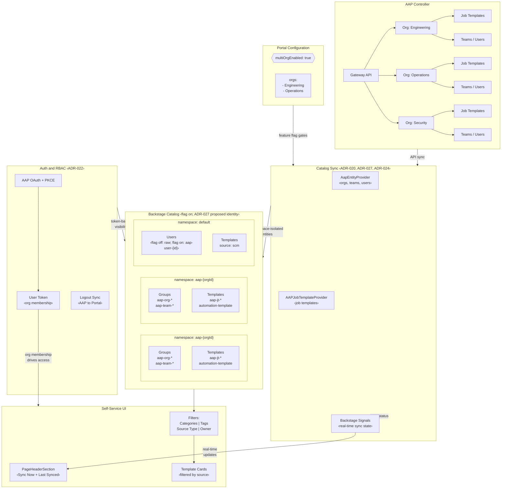

# ADR-026: Multi-Org Architecture Overview (ANSTRAT-912)

**Audience:** `common` — see [ADR index](../index.md).

**Status**: Accepted (architecture; ADR-027 naming and namespaces below remain proposed)
**Date**: 2026-08-19
**Deciders**: Portal team
**Scope**: End-to-end multi-org architecture — ties together ADRs 020–024 and 027

## Context

ANSTRAT-912 delivers multi-AAP-organization support for the Ansible Automation Portal. The feature spans namespace isolation, catalog entity naming, template taxonomy, auth/session management, and sync UX. ADRs 020–024 and 027 capture those decisions; this document provides the architectural overview that connects them. The ID-based names and namespaces shown here are the **proposed ADR-027 contract**, conditional on its acceptance; ADR-020 remains in force for those decisions until then. Shared frontend library extraction (ADR-025 / plugin factory) is separate future work — not part of multi-org.

## Architecture

## Data Flow

1. **Configuration** — Admin enables `multiOrgEnabled: true` and lists target orgs. Feature flag gates multi-org **names and namespaces** (ADR-020, ADR-027). With the flag off, org-scoped entities keep slug names in `default`.

2. **Sync** — `AapEntityProvider` syncs orgs, teams, users; `AAPJobTemplateProvider` syncs job templates. Under proposed ADR-027, the flag-on entity `metadata.name` uses `{source}-{type}-{id}` (e.g. `aap-org-1`, `aap-team-12`, `aap-jt-5238`, `aap-user-42`) and each org's entities land in `{source}-{org-id}` (e.g. `aap-2`, `aap-3`); users stay in `default` as `aap-user-{id}`. With the flag off, names and namespaces stay as today (including raw usernames). Backstage Signals push real-time sync state to the UI (ADR-024).

3. **Namespace Isolation** — Under proposed ADR-027 with `multiOrgEnabled: true`, groups and templates are scoped per `{source}-{org-id}` namespace. Two orgs with a team named "Engineering" coexist as e.g. `group:aap-2/aap-team-5` and `group:aap-3/aap-team-9`; group display names include org context (`Team: Engineering ({org})`). Users remain in `default` to avoid duplication across orgs (ADR-020, ADR-027).

4. **Template Taxonomy** — Synced templates use `spec.type: automation-template` with `ansible.com/template-source: aap-template`. User-added SCM templates use `source: scm`. The Source Type filter enables UI-level categorization (ADR-021).

5. **Auth and Session** — Users authenticate via AAP OAuth (PKCE). With the flag off, catalog and auth resolve the **raw** AAP username. Under proposed ADR-027, the flag-on contract uses `{source}-user-{id}` and auth looks up / creates by AAP user id — same flag, same PR if ADR-027 is accepted ([AAP-93502](https://redhat.atlassian.net/browse/AAP-93502)). Logout from AAP terminates the portal session (ADR-022).

6. **UI** — `PageHeaderSection` provides Sync Now with progress popover and last-synced tooltip. Source Type, Categories, Tags, and Owner filters narrow the template view.

## ADR Index

| ADR                                                    | Title                                           | Scope                                                                                                                            |
| ------------------------------------------------------ | ----------------------------------------------- | -------------------------------------------------------------------------------------------------------------------------------- |
| [ADR-020](020-multi-org-namespace-isolation.md)        | Namespace Isolation                             | Feature flag, users / `aap-admins` in `default`, config-time collision validation                                                |
| [ADR-021](../host/021-template-type-taxonomy.md)               | Template Type Taxonomy                          | `automation-template` type, `template-source` annotation                                                                         |
| [ADR-022](022-multi-org-rbac-and-auth.md)              | RBAC and Auth                                   | AAP as RBAC source of truth, OAuth, logout sync                                                                                  |
| [ADR-023](../host/023-per-template-rbac-filtering.md)          | Per-Template RBAC Filtering                     | Execute visibility filtering (future — separate epic)                                                                            |
| [ADR-024](../host/024-sync-ux-backstage-signals.md)            | Sync UX — Backstage Signals                     | Real-time sync state, progress popover                                                                                           |
| [ADR-027](027-catalog-entity-naming-and-namespaces.md) | Catalog Entity Naming and Namespaces (Proposed) | Proposed: flag off → slug / raw user in `default`; flag on → `{source}-{type}-{id}` + `{source}-{org-id}` + `{source}-user-{id}` |

## Consequences

### What this enables

- Single portal instance serves multiple AAP orgs without entity collisions (id-based names + `{source}-{org-id}` namespaces when flag on, pending ADR-027 acceptance)
- Flag-off upgrades keep slug entity names in `default` (no ref break for single-org)
- Source-based template filtering across AAP, SCM, and future sources
- Consistent sync UX across Templates, Collections, and Git Repos pages

### What remains out of scope

- Per-template execute RBAC visibility (ADR-023 — separate epic)
- Per-org granular sync selection in the UI
- Workflow and orchestrator template sources (documented, not implemented)
- Shared frontend library / `portal-react` (ADR-025 — plugin factory; not multi-org)

## Related

- [ANSTRAT-912](https://redhat.atlassian.net/browse/ANSTRAT-912) — Portal multi-org support
- [AAP-80077](https://redhat.atlassian.net/browse/AAP-80077) — Frontend multi-org fixes epic
- [ANSTRAT-2270](https://redhat.atlassian.net/browse/ANSTRAT-2270) — Plugin Factory initiative
