# ADR-001: Configuration Storage and Precedence

**Audience:** `host` — see [ADR index](../index.md).

**Status**: Proposed
**Date**: 2026-04-09
**Deciders**: Portal team

## Context

The portal needs persistence for ~99 application settings across RHEL VM, OpenShift, and managed services (see [ADR-002](002-config-boundary-rule.md) inventory). Settings include scalars and complex nested structures. The system must define storage, nested-data handling, and precedence when file and DB both define the same key.

## Alternatives Considered

### Storage layer

| Alternative                                          | Source | Why rejected                                                               |
| ---------------------------------------------------- | ------ | -------------------------------------------------------------------------- |
| Environment variables only                           | —      | Flat strings only — no encryption, no nested structures, no arrays/objects |
| File-based writes to `app-config.<environment>.yaml` | —      | Read-only filesystem on OCP; no locking; container restarts lose changes   |
| Platform-native stores (ConfigMaps, Podman secrets)  | —      | Two code paths; RBAC escalation for ConfigMap writes; no transactions      |
| External config server (Consul, Spring Cloud Config) | —      | Extra dependency; Backstage can't hot-reload regardless; over-engineered   |

### Nested data format

| Alternative                              | Source | Why rejected                                                                |
| ---------------------------------------- | ------ | --------------------------------------------------------------------------- |
| Flat dot-separated keys (`repos.0.name`) | —      | Row explosion for arrays; partial writes corrupt state; hard to reconstruct |
| Separate JSON table                      | —      | Two code paths in `configTreeBuilder`; same table can hold both formats     |

### Precedence model

| Alternative                                | Source  | Why rejected                                                                                  |
| ------------------------------------------ | ------- | --------------------------------------------------------------------------------------------- |
| File wins for all keys (AWX model)         | AWX     | Unnecessary per-key checks when no file values exist (common case)                            |
| DB wins unconditionally (Puppet model)     | Puppet  | Violates admin expectation that explicit file values stick; 0/10 competitors use this         |
| Layered conf files (Splunk 7-layer)        | Splunk  | Over-engineered for two sources; Backstage doesn't support arbitrary layers                   |
| GUI editable, reverts on restart (Jenkins) | Jenkins | Worst UX — changes silently disappear; universally cited as Jenkins' biggest admin pain point |

## Decision

**1. DatabaseConfigSource as persistence layer.** `portal_config` PostgreSQL table, injected into `rootConfig` at startup. Secrets encrypted with AES-256-GCM using `BACKEND_SECRET`. Schema via Knex migrations.

**2. JSON blobs for nested config.** Complex settings (PAH repos, Git sources) stored as JSON blobs per category in the same table. Simple settings remain flat key-value rows. `configTreeBuilder` detects and parses JSON values during assembly.

```mermaid
flowchart TD
    FILE["app-config.environment.yaml"] --> MERGE["ConfigSource Merger"]
    DB["portal_config DB — flat keys + JSON blobs"] --> MERGE

    MERGE --> CHECK{GUI-managed key in file?}
    CHECK -->|YES| RO["Use file value, mark read-only in GUI"]
    CHECK -->|NO| ED["Use DB value, mark editable"]
    MERGE --> FO["File-only keys: use file value directly"]

    RO --> ROOT["rootConfig — each key tagged source = file | database | default"]
    ED --> ROOT
    FO --> ROOT

    ROOT --> GUI["GUI: read-only badge on file-controlled keys"]
    ROOT --> CLI["CLI / API: source field in response"]
```

**3. Non-overlapping domains with file-wins override.** GUI-managed settings live in the DB. `app-config.<environment>.yaml` (e.g., `app-config.production.yaml`) covers settings the GUI does not manage. If an admin explicitly sets a GUI-managed key in the file, the file value wins and the GUI shows it read-only with a `source` indicator (`file` | `database` | `default`).

## Consequences

**Positive:**

- Single DB table across all surfaces with AES-256-GCM encryption at rest
- JSON blobs preserve nested structure with atomic updates
- Non-overlapping domains eliminate precedence conflicts in normal operation; file override provides GitOps safety net

**Negative:**

- Bootstrap chicken-and-egg (solved via `bootstrapConnection`)
- Secret rotation requires re-encryption
- GUI must render read-only state for file-overridden keys

## Related

- Research: 001 (research not published in this repository), 002 (research not published in this repository), 003 (research not published in this repository), 004 (research not published in this repository), 006 (research not published in this repository), 007 (research not published in this repository), 008 (research not published in this repository)
- `plugins/backstage-rhaap/` — DatabaseConfigSource, configTreeBuilder, config API
