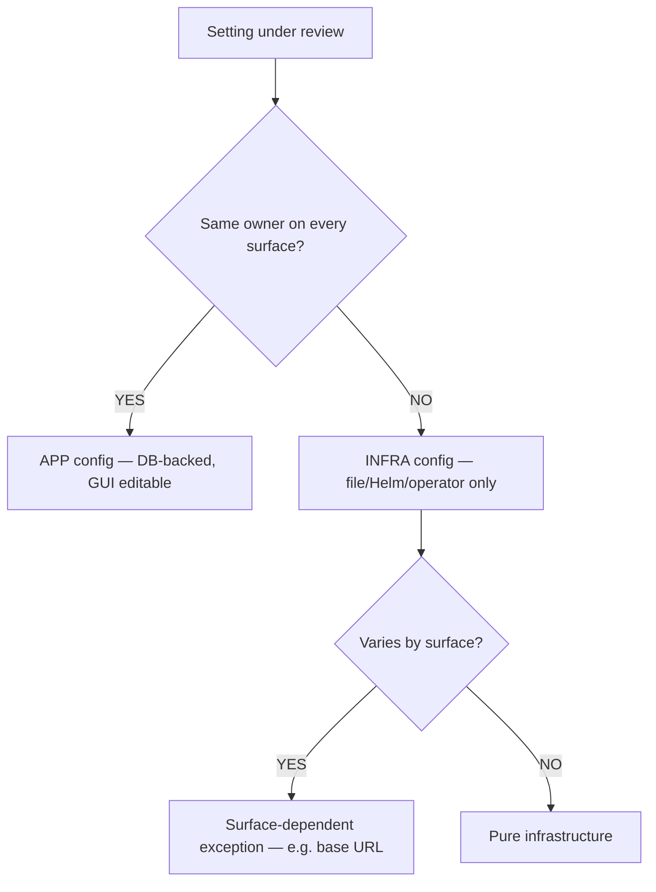

# ADR-002: Configuration Boundary Rule

**Audience:** `host` — see [ADR index](../index.md).

**Status**: Proposed
**Date**: 2026-04-09
**Deciders**: Portal team

## Context

The portal runs on RHEL VM, OpenShift, and future managed services — each with different config tooling (TUI, Helm, operator). A boundary rule is needed to classify settings as infrastructure (deployment tooling) vs application (portal GUI/API). Some settings (e.g., base URL) genuinely differ in ownership by surface.

## Alternatives Considered

### Boundary rule

| Alternative                                   | Source    | Why rejected                                                              |
| --------------------------------------------- | --------- | ------------------------------------------------------------------------- |
| Restart boundary (requires restart = infra)   | GitLab    | Portal requires restart for all changes — every setting would be "infra"  |
| Audience boundary (platform eng vs app admin) | Puppet    | Same admin wears both hats on VM; no clear role separation in small teams |
| Frequency boundary (rarely changed = infra)   | FortiGate | Subjective — no empirical data; differs by org                            |
| Single flat classification, no exceptions     | —         | Ignores that port/TLS/base URL have different owners per surface          |

### Base URL classification

| Alternative                           | Source | Why rejected                                                                              |
| ------------------------------------- | ------ | ----------------------------------------------------------------------------------------- |
| Purely infrastructure on all surfaces | —      | Breaks VM wizard — admin can't fix wrong auto-detected IP; OAuth callback fails           |
| Purely application on all surfaces    | —      | Redundant on OCP where Route overrides it; managed service sets it from platform metadata |

## Decision

**1. Domain boundary rule.** "If a setting cannot have the same owner on every deployment surface, it is infrastructure." Infrastructure is pre-boot, file/Helm/operator only, and is **not** Day 2 web-GUI editable. Application config is post-boot, DB-backed, GUI + API editable. The setup wizard may confirm or correct a documented surface-dependent exception (rule 2); that is not Day 2 settings-page editing.

| Classification | Scope                          | Storage                  | UI                  |
| -------------- | ------------------------------ | ------------------------ | ------------------- |
| Infrastructure | Pre-boot, deployment-specific  | Files, Helm, operator CR | TUI/CLI only        |
| Application    | Post-boot, deployment-agnostic | DB (portal_config)       | Web GUI + CLI + API |

**2. Surface-dependent exceptions.** Base URL (`backend.baseUrl`) is the concrete exception:

- **OpenShift**: auto-derived from Route (`clusterRouterBase`), admin confirms/corrects in wizard Step 2
- **VM**: auto-detected from host IP, admin confirms/corrects in wizard Step 2
- **Managed**: determined by platform metadata, admin confirms in wizard Step 2

### Settings inventory

The inventories below classify every setting. `backend.baseUrl` stays in the **infrastructure** Networking row (deployment-owned) and is the rule-2 exception: wizard Step 2 may confirm or correct it. It is not a Day 2 application setting. Row totals for application settings (30 in UI today, ~69 YAML-only, ~99 combined) are the sum of the domain counts; the earlier “~84” figure was a stale roll-up and is not used here. Summary:

#### Infrastructure (~31 settings) — deployment tooling only

| Domain                     | Count | Examples                                                                                                              |
| -------------------------- | ----- | --------------------------------------------------------------------------------------------------------------------- |
| Database                   | 7     | `backend.database.connection.host`, `.port`, `.user`, `.password`, `.ssl`                                             |
| Networking / TLS           | 6     | `app.baseUrl`, `backend.baseUrl` (wizard confirm/correct only), `backend.listen.port`, TLS certs, `clusterRouterBase` |
| Container runtime / images | 5     | Container image, plugin loading mode, `global.imageRegistry`, Dev Tools sidecar                                       |
| Auth bootstrap             | 3     | `BACKEND_SECRET`, `PORTAL_ADMIN_PASSWORD_HASH`, `auth.environment`                                                    |
| Backstage core             | 5     | `backend.reading.allow`, `catalog.stitchingStrategy`, `catalog.orphanStrategy`, `permission.enabled`                  |
| Environment / telemetry    | 2     | `_environment._production`, `SEGMENT_WRITE_KEY`                                                                       |
| Backup (RHEL only)         | 3     | Backup enabled, schedule, retention                                                                                   |

#### Application (~99 settings) — portal GUI/API + DB

| Domain                | In UI today | In YAML only | Total   | Examples                                                                                 |
| --------------------- | ----------- | ------------ | ------- | ---------------------------------------------------------------------------------------- |
| AAP connection        | 5           | —            | 5       | `aap.controller_url`, `.admin_token`, `.oauth_client_id`, `.check_ssl`                   |
| AAP sync              | —           | 8            | 8       | Orgs, org/user/team schedule, job template enabled/labels/survey                         |
| Registries            | 7           | —            | 7       | `registries.pah_enabled`, `.pah_url`, `.pah_token`, certified/validated/galaxy toggles   |
| PAH collection sync   | —           | 4            | 4       | Per-repo name, schedule frequency, timeout                                               |
| SCM connection (x2)   | 18          | —            | 18      | `scm.<provider>.provider_url`, `.token`, `.target_orgs`, `.branches`, `.max_depth`       |
| SCM content discovery | —           | ~42          | ~42     | Per-source name/host, per-org branches/tags/crawlDepth/schedule                          |
| Portal features       | —           | 4            | 4       | `ansible.portal.onboarding.enabled`, `ansible.feedback.enabled`                          |
| Admin state           | —           | 2            | 2       | `setupComplete`, `localAdminEnabled`                                                     |
| RBAC                  | —           | 3            | 3       | `permission.rbac.admin.users`, `.superUsers`, `.pluginsWithPermission`                   |
| Ancillary services    | —           | 6            | 6       | `ansible.devSpaces.baseUrl`, `ansible.automationHub.baseUrl`, `ansible.creatorService.*` |
| **Totals**            | **30**      | **~69**      | **~99** |                                                                                          |

Full inventory: research doc 003 (research not published in this repository). Classification rules: research doc 001 (research not published in this repository).

## Consequences

**Positive:**

- Every contested setting resolved by one rule; works across all surfaces
- Simplifies TUI to infrastructure-only settings

**Negative:**

- Surface-dependent exceptions (port, TLS, base URL) require deployment detection logic
- Exceptions must be clearly documented

## Related

- Research: 001 (research not published in this repository), 003 (research not published in this repository), 005 (research not published in this repository), 006 (research not published in this repository), 007 (research not published in this repository)
- ADR-001 (config storage), ADR-003 (wizard Step 2 uses base URL)
