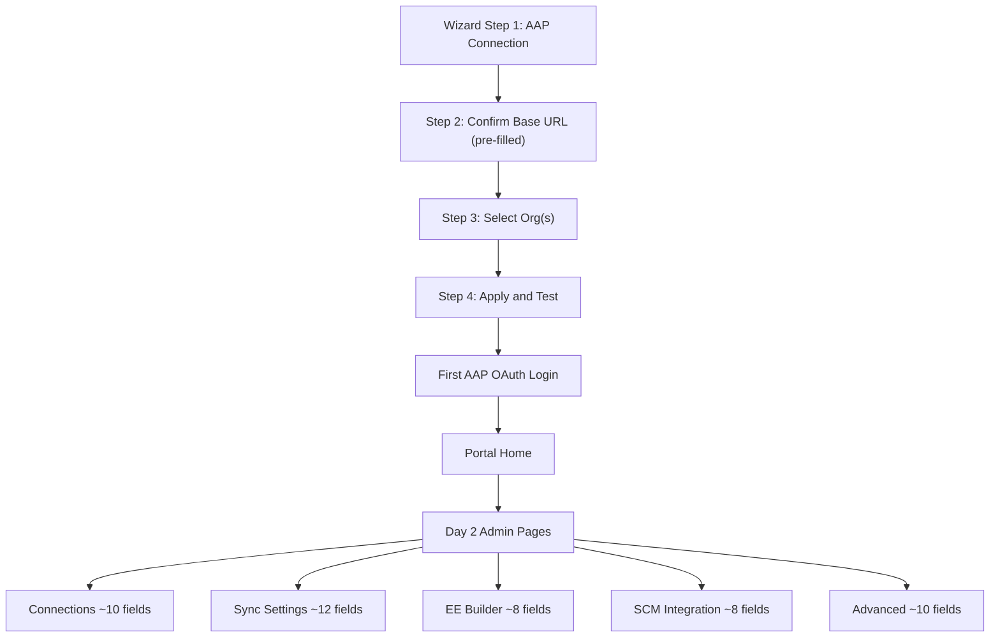

# ADR-003: Admin Experience — Wizard and Settings Pages

**Audience:** `host` — see [ADR index](../index.md).

**Status**: Proposed
**Date**: 2026-04-09
**Deciders**: Portal team

## Context

The portal needs a first-run wizard and Day 2 admin pages. Two wizard scopes were debated (broad 5-step vs narrow 4-step). The team also debated how many settings to surface in the GUI (~15 total cap vs progressive disclosure across pages).

## Alternatives Considered

| Alternative                                                          | Source | Why rejected                                                                        |
| -------------------------------------------------------------------- | ------ | ----------------------------------------------------------------------------------- |
| Broad 5-step wizard (AAP + registries + SCM)                         | —      | ~15-20 fields — completion rates drop beyond 5; registries/SCM not in login chain   |
| Hard ~15 total GUI cap, CLI as primary                               | —      | Team clarified ~15 is per-page, not total; EE Builder and SCM must be in GUI        |
| Full inventory (~99; originally counted as ~84) across 3 UI patterns | —      | High complexity; users change 4-5 settings regardless; cost not justified           |
| Bidirectional form/YAML sync                                         | —      | Significant engineering cost; no usage data to justify; partial edits corrupt state |

## Decision

**1. Wizard scope — minimal path to first login.** 4-step wizard with ~5 fields: (1) AAP Connection, (2) Confirm Base URL (pre-filled from Route on OCP, host IP on VM, platform metadata on managed; admin confirms or edits), (3) Select AAP Org(s), (4) Apply and Test. Registries and SCM are Day 2.

**2. Progressive disclosure for Day 2.** Settings per page should remain scannable and manageable. ~15 fields is a starting point, but collapsible sections, dropdowns, and progressive disclosure patterns can accommodate more without increasing page count. Settings distributed across dedicated admin pages: Connections, Sync Settings, EE Builder, SCM Integration, Advanced. CLI is a superset covering all ~99 application settings ([ADR-002](002-config-boundary-rule.md)). YAML download/upload for headless workflows.

## Consequences

**Positive:**

- ~70% fewer wizard fields — higher completion rate
- Essential integrations in GUI; scannable pages via progressive disclosure patterns

**Negative:**

- Content sync (registries, SCM) unavailable until Day 2 config
- More admin pages to build; CLI docs critical for niche settings

## Related

- Research: 002 (research not published in this repository), 003 (research not published in this repository), 006 (research not published in this repository), 007 (research not published in this repository)
- ADR-002 (base URL in wizard Step 2)
- `plugins/self-service/` — wizard and admin page UI
