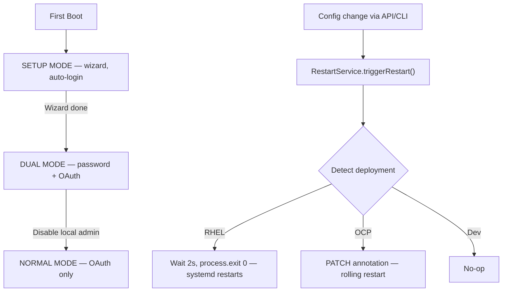

# ADR-004: Authentication and Restart Lifecycle

**Audience:** `host` — see [ADR index](../index.md).

**Status**: Proposed
**Date**: 2026-04-09
**Deciders**: Portal team

## Context

The portal lifecycle has three phases: initial setup (no OAuth), dual testing (local + OAuth), and production (OAuth only). The original 2-mode auth design failed because Backstage's `ProxiedSignInPage` auto-re-authenticates on logout. Separately, config changes require a process restart because Backstage's `rootConfig` is frozen and plugins cache values at startup.

## Alternatives Considered

### Authentication

| Alternative                               | Source    | Why rejected                                                                      |
| ----------------------------------------- | --------- | --------------------------------------------------------------------------------- |
| Custom Express `/local-login` router      | —         | Fragile custom tokens; duplicated security logic outside Backstage auth framework |
| Backstage guest provider                  | Backstage | Anonymous with no password; being deprecated upstream; no audit trail             |
| Two-mode auth (setup → normal, skip dual) | —         | `ProxiedSignInPage` auto-re-authenticates on logout, preventing mode switch       |

### Restart mechanism

| Alternative                               | Source | Why rejected                                                                      |
| ----------------------------------------- | ------ | --------------------------------------------------------------------------------- |
| `child_process.exec('systemctl restart')` | —      | Command injection risk; privilege escalation; doesn't work on OCP                 |
| SIGHUP / config hot-reload                | —      | Backstage doesn't support hot-reload; community plugins cache config at startup   |
| Config polling                            | —      | Only works for portal-owned code; community plugins don't support runtime changes |

## Decision

**1. Three authentication modes.**

| Mode   | Condition                                       | Behavior                                  |
| ------ | ----------------------------------------------- | ----------------------------------------- |
| Setup  | `setupComplete=false`                           | `ProxiedSignInPage` auto-login for wizard |
| Dual   | `setupComplete=true`, `localAdminEnabled=true`  | Password form + AAP OAuth button          |
| Normal | `setupComplete=true`, `localAdminEnabled=false` | AAP OAuth with auto-redirect              |

**2. Deployment-aware restart without shell execution.** `RestartService` detects deployment mode at runtime. Zero `child_process.exec()`.

| Deployment | Mechanism                                         | Downtime  |
| ---------- | ------------------------------------------------- | --------- |
| RHEL VM    | `process.exit(0)` — systemd `Restart=always`      | ~10-30s   |
| OpenShift  | K8s Deployment annotation PATCH — rolling restart | Near-zero |
| Local dev  | No-op                                             | N/A       |

2-second grace period before exit. AAP auth plugin (60s TTL cache) is the sole restart exception.

## Consequences

**Positive:**

- Solves `ProxiedSignInPage` auto-re-auth with a third mode using native Backstage auth patterns
- No command injection risk; rolling restart on OCP for near-zero downtime

**Negative:**

- Three auth modes add sign-in page complexity (dual mode is a Backstage workaround)
- ~10-30s RHEL downtime during restart; browser reconnect UX needed

## Related

- Research: 002 (research not published in this repository), 004 (research not published in this repository)
- `plugins/auth-backend-module-rhaap-provider/` — auth modes
- `plugins/backstage-rhaap/` — RestartService
