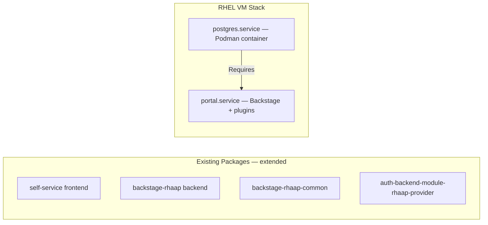

# ADR-005: Deployment Architecture — Plugins and Database

**Audience:** `host` — see [ADR index](../index.md).

**Status**: Proposed
**Date**: 2026-04-09
**Deciders**: Portal team

## Context

Admin functionality (wizard, admin pages, config API, auth modes) must be added to the portal's plugin ecosystem. The question is whether to create new packages or extend existing ones. Separately, the RHEL VM needs a database — the question is whether to require external PostgreSQL or bundle it.

## Alternatives Considered

### Plugin packaging

| Alternative                                                      | Source | Why rejected                                                                                      |
| ---------------------------------------------------------------- | ------ | ------------------------------------------------------------------------------------------------- |
| Three new packages (admin-frontend, admin-backend, admin-common) | —      | Duplicated build/packaging infra; extra artifacts to publish and version; shared state complexity |

### Database provisioning (RHEL VM)

| Alternative                | Source | Why rejected                                                                                        |
| -------------------------- | ------ | --------------------------------------------------------------------------------------------------- |
| External DB required on VM | —      | Highest install friction; 8/14 competitors bundle a database; Day-0 complexity discourages adoption |
| SQLite for production      | —      | No concurrent writes; no built-in auth; dev-only per upstream Backstage guidance                    |

## Decision

**1. Extend existing plugins, no new packages.**

| Functionality                      | Target Package                       |
| ---------------------------------- | ------------------------------------ |
| Config DB, setup API, restart, CLI | `backstage-rhaap` (backend)          |
| Admin pages, wizard UI             | `self-service` (frontend)            |
| Auth modes                         | `auth-backend-module-rhaap-provider` |
| Shared types                       | `backstage-rhaap-common`             |

Admin pages lazy-loaded via `React.lazy()` — non-admin users never download admin code.

**2. Bundled PostgreSQL on RHEL VM.** Ships PostgreSQL via Podman container with auto-generated credentials (Podman secrets). External DB supported but not required. Podman Quadlet `Requires=postgres.service` ensures DB readiness. Migration from bundled to external is manual with downtime.

## Consequences

**Positive:**

- Fewer packages to maintain; lazy-loaded admin code keeps bundle size small
- Zero-config DB on VM matches OCP experience (where DB is auto-provisioned)

**Negative:**

- Existing packages grow in scope; Podman lifecycle to maintain on RHEL
- Bundled-to-external DB migration requires downtime

## Related

- Research: 002 (research not published in this repository), 005 (research not published in this repository), 006 (research not published in this repository)
- `plugins/self-service/`, `plugins/backstage-rhaap/`, `plugins/backstage-rhaap-common/`, `plugins/auth-backend-module-rhaap-provider/`
