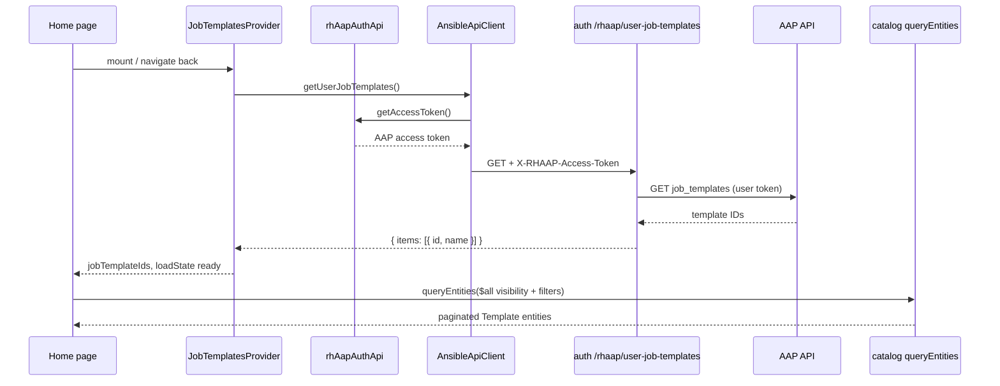
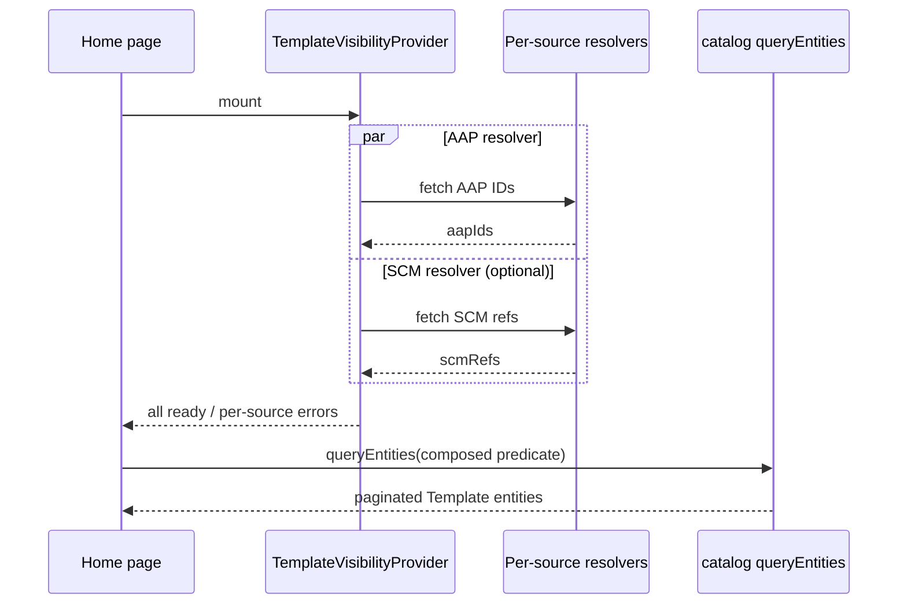

# Home Template Listing (AAP-First Visibility)

The Self-Service **Templates** home page lists catalog templates the signed-in user is allowed to run in Ansible Automation Platform (AAP). Visibility is driven by the user's live AAP job-template permissions, not only by what was synced into the catalog.

This complements [Job Template Synchronization](job-templates.md), which imports templates from AAP on a schedule. The home page answers a different question: _which of those catalog entries can this user execute right now?_

## Overview

| Concern                       | Mechanism                                                       |
| ----------------------------- | --------------------------------------------------------------- |
| What the user can run in AAP  | `GET /api/auth/rhaap/user-job-templates`                        |
| What exists in the catalog    | `queryEntities` with a server-side filter predicate             |
| Session / token for AAP       | `rhAapAuthApi.getAccessToken()` → `X-RHAAP-Access-Token` header |
| Stable list across navigation | `JobTemplatesProvider` caches IDs at the route level            |

### Key behaviors

- **AAP-backed templates** (`metadata.aapJobTemplateId` set) appear only when that ID is in the user's current AAP job-template list.
- **SCM / non-AAP templates** (no `aapJobTemplateId`) always pass the visibility filter.
- The catalog query runs only after the AAP list fetch succeeds (`loadState === 'ready'`). On failure, the page shows an error with **Retry** instead of falling back to SCM-only results.
- Pagination is server-side (default page size 20; options 10, 20, 50, 100).

For adding SCM or other external providers, see [Extensibility](#extensibility-scm-and-future-providers).

## Architecture



## Backend: user job templates endpoint

**Route:** `GET /api/auth/rhaap/user-job-templates`

**Module:** `auth-backend-module-rhaap-provider` (`userJobTemplatesRouter.ts`)

### Authentication

1. **Backstage user session** — `httpAuth.credentials(req, { allow: ['user'] })`. Unauthenticated callers receive `401`.
2. **AAP access token** — resolved in this order:
   - **`X-RHAAP-Access-Token` request header** (preferred; sent by the Self-Service frontend).
   - **`rhaap-refresh-token` cookie** — refresh via `rhAAPAuthenticate`, then call AAP. Used when no header is present (for example direct API use).

The route is registered with `allow: 'unauthenticated'` on the auth HTTP router so the handler can perform its own `httpAuth` check; callers still need a valid Backstage session.

### Response

```json
{
  "items": [{ "id": 42, "name": "Deploy application" }]
}
```

IDs come from `ansibleService.getResourceData('job_templates', accessToken)` using the same org/label filters as catalog sync (see [job-templates.md](job-templates.md)).

### Error responses

| Status | Typical cause                                                                  |
| ------ | ------------------------------------------------------------------------------ |
| `401`  | No Backstage session, missing/invalid AAP token, or `invalid_grant` on refresh |
| `502`  | AAP unreachable or unexpected failure after token resolution                   |

## Frontend

### API client

`AnsibleApiClient.getUserJobTemplates()` (`plugins/self-service/src/apis.ts`):

1. Calls `rhAapAuthApi.getAccessToken()`.
2. Sends `X-RHAAP-Access-Token` on the request to the auth plugin base URL.
3. Maps `invalid_grant` (and empty token) to: _Your AAP sign-in session expired. Sign out and sign in again._

`AAPApis` factory depends on `rhAapAuthApiRef` so the client always has access to the OAuth session.

### JobTemplatesProvider

Wraps template routes so AAP IDs survive remounts when navigating away and back.

| State     | UI                                           |
| --------- | -------------------------------------------- |
| `loading` | Skeleton placeholders                        |
| `ready`   | Catalog list with visibility predicate       |
| `error`   | Message + **Retry** (does not query catalog) |

**Mount points:**

- `RouteView.tsx` — layout route for `/self-service/catalog` and template detail (dev app `yarn start`).
- `Home.tsx` — `TemplatesRoutesPage` wrapper for production-style routing.

### Catalog visibility predicate

`buildVisibilityPredicate(jobTemplateIds)` (`buildVisibilityPredicate.ts`):

```text
$any:
  - metadata.aapJobTemplateId does not exist     # SCM templates
  - metadata.aapJobTemplateId $in [user's IDs]  # AAP templates user can run
```

`buildHomeTemplateCatalogQuery` combines this with category/tag/owner/source filters via `$all`.

If `jobTemplateIds` is empty (should not happen in `ready` state), only SCM templates would match — which is why the UI blocks the catalog query until the AAP fetch succeeds.

### Pagination

Constants in `constants.ts`: default `PAGE_SIZE = 20`, options `[10, 20, 50, 100]`. Footer shows range (`1–20 of N`), page size selector, and prev/next controls.

## Routing notes

| Environment                              | Entry                           | Provider location                   |
| ---------------------------------------- | ------------------------------- | ----------------------------------- |
| Local dev (`packages/app`, `yarn start`) | `SelfServicePage` → `RouteView` | `RouteView` layout `<Route>`        |
| Dynamic plugin / RHDH                    | Plugin route tree               | `TemplatesRoutesPage` in `Home.tsx` |

Both paths must wrap template catalog routes in `JobTemplatesProvider`. Otherwise `useJobTemplates` throws or the list refetches with empty IDs on every remount.

## Extensibility (SCM and future providers)

The current implementation is the **first provider** (AAP). The same pattern applies to SCM, workflows, orchestrator, or any external system where catalog sync alone is not enough to decide what a user can run.

### Two layers of visibility

Every template on the home page passes through two independent checks:

| Layer              | Question                                                        | Mechanism                                              |
| ------------------ | --------------------------------------------------------------- | ------------------------------------------------------ |
| **Catalog access** | Is this entity in the catalog and readable by the user?         | Backstage catalog RBAC / permission plugin (unchanged) |
| **Source access**  | Does the user have permission in the external system right now? | Per-provider resolver (AAP today; others optional)     |

Source access only matters for templates tied to an external system. Templates with no external ID rely on catalog access alone.

### How sources differ today

| Source                                 | `ansible.com/template-source` | External ID                 | Live permission API                      |
| -------------------------------------- | ----------------------------- | --------------------------- | ---------------------------------------- |
| **AAP job template**                   | `aap-template`                | `metadata.aapJobTemplateId` | `GET /api/auth/rhaap/user-job-templates` |
| **SCM**                                | `scm` (or unset / legacy)     | None                        | None — catalog RBAC only                 |
| **Future** (workflow, orchestrator, …) | TBD per taxonomy              | TBD per provider            | TBD per provider                         |

SCM templates pass the visibility filter because they have **no** `aapJobTemplateId` — see the `$exists: false` branch in `buildVisibilityPredicate`. That is intentional: sync already controls which SCM templates enter the catalog, and catalog RBAC gates who can read them.

`SourcePicker` filters by `ansible.com/template-source` for UX only. It is not an authorization boundary.

### What generalizes without rewrites

These pieces are provider-agnostic and should stay stable as new sources are added:

1. **Route-level cache** — `JobTemplatesProvider` can evolve into a `TemplateVisibilityProvider` that holds allow-lists and load state per source.
2. **Composed catalog query** — `buildHomeTemplateCatalogQuery` already combines predicates with `$all`; each provider contributes one branch.
3. **Source taxonomy** — `ansible.com/template-source` identifies which branch applies to an entity.
4. **Load-then-query** — Do not call `queryEntities` until resolvers that block listing (today: AAP) reach `ready` or surface a clear error.

### Per-provider contract

When adding a source that needs **live** external permissions, implement this checklist:

| #   | Deliverable                      | Notes                                                                                                                |
| --- | -------------------------------- | -------------------------------------------------------------------------------------------------------------------- |
| 1   | **`template-source` value**      | e.g. `aap-template`, `scm`, `aap-workflow`, `orchestrator`                                                           |
| 2   | **Stable external ID on entity** | One canonical metadata field or annotation (e.g. `metadata.aapJobTemplateId`, or `ansible.com/scm-repo-ref` for SCM) |
| 3   | **Backend resolver**             | `resolveVisibleIds(user) → string[]` — one route per provider is fine; avoid a single mega-endpoint                  |
| 4   | **Auth for upstream API**        | User OAuth token, app installation, or service account — same header/cookie patterns as AAP where applicable         |
| 5   | **Predicate branch**             | `buildXVisibilityPredicate(ids)` — one `$any` branch keyed on source + ID field                                      |
| 6   | **Frontend fetch + cache**       | Register in the route-level provider; expose `loadState` / `errorMessage` / `refresh`                                |
| 7   | **Error UX**                     | Per-provider re-auth messaging (e.g. AAP `invalid_grant` → sign out and sign in)                                     |

### Composed visibility predicate

Today (AAP + SCM passthrough):

```text
$any:
  - metadata.aapJobTemplateId does not exist          # SCM / non-AAP
  - metadata.aapJobTemplateId $in [user AAP IDs]    # AAP
```

With multiple live providers, merge branches — one endpoint per provider, one predicate branch per source:

```text
visibility = $all [
  kind = Template,
  user filters (category, tag, owner, source picker, …),
  $any [
    # No external ID — catalog RBAC is sufficient
    { externalIdField: { $exists: false } },

    # AAP job templates
    { $and: [
        { 'metadata.annotations.ansible.com/template-source': 'aap-template' },
        { 'metadata.aapJobTemplateId': { $in: aapIds } }
      ]
    },

    # SCM (only if live repo ACL is required later)
    { $and: [
        { 'metadata.annotations.ansible.com/template-source': 'scm' },
        { 'metadata.annotations.ansible.com/scm-repo-ref': { $in: scmRefs } }
      ]
    },

    # Future providers follow the same shape
  ]
]
```

NOTE: Tighten the SCM passthrough branch once SCM gets a live resolver — scope the `$exists: false` case to entities that genuinely have no external ACL, or gate by `template-source` so AAP entities never fall through by accident.

### SCM: today vs later

**Today (no code change required):** SCM visibility = in catalog + user can read the entity. No second API call.

**Later (if repo-level ACL matters):** Add an SCM resolver parallel to AAP:

- Backend calls GitHub/GitLab (or similar) with the user's SCM token or an installation token.
- Returns repo refs or template keys the user can access.
- Catalog entities carry a matching `ansible.com/scm-repo-ref` (or equivalent).
- Predicate branch filters SCM templates to that allow-list.

### Multi-provider flow (target shape)



Resolvers can run in parallel. Block the catalog query only for sources marked **required** (AAP is required today because an empty AAP list would hide all AAP templates incorrectly).

## Troubleshooting

### "Could not load your AAP job templates" / session expired

**Symptom:** Error on the Templates home page; backend logs may show `user-job-templates token refresh failed` or `invalid_grant`.

**Cause:** The AAP OAuth refresh token or access token is stale while the Backstage session still appears signed in. Common after AAP restarts, OAuth app changes, or long idle periods.

**Fix:**

1. **Sign out** of the portal (RHAAP provider).
2. **Sign in** again to obtain fresh OAuth tokens.
3. Use **Retry** only after a new sign-in — retry alone does not fix `invalid_grant`.

### Only SCM templates visible after navigation

**Symptom:** After leaving Templates and returning, only non-AAP templates appear.

**Cause (historical):** `jobTemplates` state lived inside `HomeComponent` and reset on remount; catalog queried with `jobTemplateIds = []`.

**Fix:** Ensure `JobTemplatesProvider` wraps the route (see [Routing notes](#routing-notes)). Do not render the catalog until `loadState === 'ready'`.

### `useJobTemplates must be used within JobTemplatesProvider`

**Cause:** A template page renders outside the provider tree (often a new route added without the layout wrapper).

**Fix:** Add `JobTemplatesProvider` to the parent layout route for all template catalog paths.

### Backend returns 401 but user looks logged in

Check:

1. Browser request to `/api/auth/rhaap/user-job-templates` includes `X-RHAAP-Access-Token`.
2. Backstage session cookie is sent (`credentials: 'include'`).
3. AAP OAuth app redirect URI matches `backend.baseUrl` (see [External Authentication](external-authentication.md)).
4. User has permission to list job templates in AAP for the configured org(s).

### Debug logging

```yaml
backend:
  logging:
    level: debug
```

Look for:

- `user-job-templates token refresh failed` — auth provider / cookie path
- `user-job-templates failed` — AAP API call after token resolution

## Related source files

| Area                  | Path                                                                                                |
| --------------------- | --------------------------------------------------------------------------------------------------- |
| Auth route            | `plugins/auth-backend-module-rhaap-provider/src/userJobTemplatesRouter.ts`                          |
| Refresh cookie reader | `plugins/auth-backend-module-rhaap-provider/src/readRefreshToken.ts`                                |
| API client            | `plugins/self-service/src/apis.ts`                                                                  |
| Provider              | `plugins/self-service/src/components/Home/JobTemplatesProvider.tsx`                                 |
| Home UI               | `plugins/self-service/src/components/Home/Home.tsx`                                                 |
| Visibility / query    | `plugins/self-service/src/components/Home/buildVisibilityPredicate.ts`, `buildHomeTemplateQuery.ts` |
| Dev routing           | `plugins/self-service/src/components/RouteView/RouteView.tsx`                                       |

## Related documentation

- [Job Template Synchronization](job-templates.md) — catalog import and entity shape
- [Auth Provider](../plugins/auth.md) — RHAAP OAuth setup
- [External Authentication](external-authentication.md) — full SSO configuration
- [Self-Service Portal](../plugins/self-service.md) — plugin overview
