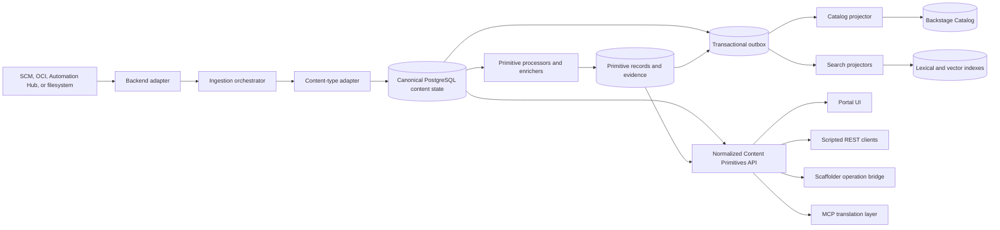

# **Content Experience Architecture & Integration Guide V4**

This guide details the end-to-end data flow, codebase layout, Model Context Protocol (MCP) integrations, Backstage mapping, dynamic domain extensions, capability registration, and ecosystem scaffolding model for building a content-agnostic, backend-agnostic experience.

> **Version note:** The historical filename retains `V3` so existing links remain valid. This document is the V4 architecture guide; the title and document status are authoritative.

## **1\. Core Architectural Concepts & Backstage Mapping**

At the center of this architecture is the **Content Primitives Model**. These primitives are computed, normalized signals attached to any automation artifact regardless of source backend.

```text
                    ┌─────────────────────────────────────────┐
                     │          CONTENT PRIMITIVES             │
                     └─────────────────────────────────────────┘
                                          │
       ┌──────────────────────────────────┼──────────────────────────────────┐
       ▼                                  ▼                                  ▼
┌──────────────┐                   ┌──────────────┐                   ┌──────────────┐
│    TRUST     │                   │    INTENT    │                   │   QUALITY    │
└──────────────┘                   └──────────────┘                   └──────────────┘
 • certification_status             • business_use_cases               • code_quality
 • publisher_identity               • target_infrastructure            • documentation
 • signing_status                   • compliance_alignment             • test_coverage
 • provenance_chain                 • capability_definitions           • structure_compliance
 • security_scan                    • content_intent                   • maintenance_signals
 • behavioral_testing               • industry_verticals               • compatibility_matrix
 • dependency_health
 • support_boundary
 • content_freshness

```

### **Standard Backstage vs. Proposal Custom Extensions**

Backstage does not provide these primitives out-of-the-box. The architecture maps custom primitives onto standard Backstage catalog constructs:

| Proposed concept          | Backstage integration     | Implementation mechanism                                                                                                                      |
| :------------------------ | :------------------------ | :-------------------------------------------------------------------------------------------------------------------------------------------- |
| **Content Entity**        | Component Kind            | Projected through `spec.type` where compatible, for example `ansible-collection` or `ansible-skill`.                                          |
| **Backend Adapter**       | Backend service extension | Discovers and reads raw content through capability-based protocol contracts; it is not itself the canonical Catalog entity provider.          |
| **Content-type Adapter**  | Backend service extension | Identifies and normalizes content semantics independently from the source protocol.                                                           |
| **Enrichment Engine**     | Primitive processor       | Persists versioned primitive records and evidence outside Catalog; asynchronous work emits transactional outbox events.                       |
| **Trust/Quality Signals** | Entity annotations/labels | Projects selected summaries into annotations, for example `ansible.com/trust-status: "verified"`; full evidence remains in canonical storage. |
| **Dependency Links**      | Catalog Relations         | Projects normalized relation records through standard relations such as `dependsOn` or approved custom relations such as `requiresEE`.        |
| **Catalog/Search**        | Rebuildable projections   | Dedicated projectors consume the outbox and can rebuild Catalog entities, annotations, relations, and search indexes from canonical state.    |

## **2\. End-to-End Technical Data Flow**

The ingestion-to-consumption flow runs across five distinct phases:



1. **Ingestion & Discovery:** Change events or polling trigger the ingestion orchestrator. A backend adapter discovers and resolves artifacts; a separate content-type adapter identifies markers such as `galaxy.yml` or `skill.yml` and normalizes an observation.
2. **Synchronous Processing:** Bounded processors perform inexpensive validation and extraction before the canonical observation transaction commits. Missing signals receive explicit semantic states such as `unknown` or `not_scanned`; processors do not write Catalog directly.
3. **Asynchronous Heavy Enrichment:** Long-running jobs run out-of-band to prevent catalog ingestion blocking:

- **Security/Scanning:** CVE scanners (Grype/Trivy) and behavioral test harnesses attach scan outputs.
- **AI Metadata Generation:** Missing intent context, business use cases, and compliance tags (SOC2, FedRAMP) are generated via AI models.
- **Trust Policy Evaluation:** Applies a versioned, evidence-based policy to native signatures, certification status, and scan results. Any aggregate score is policy output with provenance and uncertainty, not a fixed value assigned by source type.

4. **Persistence & Projection:** Canonical content observations, primitives, evidence, jobs, and events are committed to PostgreSQL with transactional outbox entries. Independent projectors update Backstage Catalog and lexical/vector indexes; those projections are rebuildable and never authoritative primitive storage.
5. **Unified Consumption:** All four surfaces—Portal UI, REST clients, Scaffolder, and MCP—consume identical primitives and typed operations over the normalized API contracts.

## **3\. Codebase Responsibilities & Core Plugin Layout**

To enforce clear boundaries, the core codebase isolates responsibilities across specific packages:

```text
plugins/
├── core/
│   ├── portal-theme/                       # Portal UI layout, global branding, shell
│   ├── portal-auth-common/                 # Portable authentication contracts
│   ├── portal-auth-frontend/               # Browser authentication composition
│   ├── portal-scaffolder-frontend/         # Scaffolder UI composition
│   └── scaffolder-backend-module-portal/   # Portal-owned Scaffolder actions
│
├── portal-extension-common/        # Serializable extension descriptors
├── portal-extension-api/           # Frontend API refs and bindings
├── portal-extension-host/          # Multi-provider extension composition
│
├── content-primitives/
│   ├── content-primitives-common/          # Portable schemas and JSON DTOs
│   ├── content-primitives-permissions/     # Backstage permission/resource contracts
│   ├── content-primitives-client/          # Browser/Node-safe normalized REST client
│   ├── content-primitives-node/            # Node extension points and service contracts
│   ├── content-primitives-backend/         # Canonical persistence, APIs, and orchestration
│   ├── content-primitives-backend-module-trust/
│   ├── content-primitives-backend-module-quality-intent/
│   ├── content-primitives-frontend/        # Generic React primitive components
│   └── content-primitives-mcp/             # Thin MCP translation over the shared client
│
├── backend-adapters/
    ├── adapter-git/                # SCM Provider (GitHub, GitLab, Gitea)
    ├── adapter-oci/                # Registry Provider (Quay, Harbor, GHCR)
  ├── adapter-automation-hub/     # Galaxy v3 / Pulp-backed Automation Hub
    └── adapter-filesystem/         # NFS / Local Filesystem Provider
│
└── content-types/
  ├── content-type-execution-environment-common/
  ├── content-type-execution-environment-node/
  ├── content-type-execution-environment-frontend/
  └── content-type-collection-node/

```

## **4\. Templating, Scaffolding, & Ecosystem Contributions**

Templating and scaffolding leverage the standard Backstage Scaffolder architecture (Template Kind). To support field personnel (Consulting, Solutions Architects) and ecosystem partners (e.g., Cisco, F5) without compromising core platform governance, scaffolding decouples **Declarative Blueprints (Data/YAML)** from **Custom Action Execution (Code/TypeScript)**.

### **A. Field & Partner Declarative Scaffolding (No Code Deployment)**

Many field and partner contributions (for example, Cisco publishing a "Router Automation Collection" blueprint) can consist of pure YAML definitions and Jinja/Cookiecutter templates stored in partner-owned SCM repositories. The proportion is not assumed; contributions requiring custom execution logic follow the governed dynamic-plugin path below.

```text
cisco-ansible-templates/ (GitHub / GitLab Repo owned by Cisco / Field)
├── template.yaml            # Standard Backstage Template definition (Kind: Template)
└── skeleton/                # Scaffolding skeleton files with variable placeholders
    ├── galaxy.yml.njk
    ├── playbooks/
    └── README.md

```

- **Ingestion:** Field or partner teams register their template.yaml URL into the Catalog Database.
- **Execution:** The Core Portal Scaffolder engine fetches the remote skeleton, renders variables, creates a new Git repository, and registers the entity into the Catalog.
- **Lifecycle:** Updating scaffolding rules requires only a Git commit in the partner repository—no platform binary rebuilds or core deployments required.

### **B. Advanced Scaffolding with Custom Actions**

When field teams or partners require custom execution logic during scaffolding (for example, validating access to a Cisco Application Centric Infrastructure tenant or executing APME modernization rules), custom actions are packaged in separate repositories as reviewed and verified RHDH Dynamic Plugins. The action remains a thin WP-026 wrapper around a server-owned registered operation; it never accepts an arbitrary endpoint or directly owns partner credentials/network execution:

```typescript
// Partner Repo: cisco-scaffolder-dynamic-plugin
import { createTemplateAction } from '@backstage/plugin-scaffolder-node';

export const createCiscoAciValidateAction = () => {
  return createTemplateAction({
    id: 'cisco:aci:validate-endpoint',
    description:
      'Validates access to an approved Cisco ACI tenant before scaffolding',
    schema: {
      input: {
        type: 'object',
        required: ['targetId', 'tenantName'],
        properties: {
          targetId: {
            type: 'string',
            title: 'Registered ACI target',
          },
          tenantName: { type: 'string', title: 'Tenant Name' },
        },
      },
    },
    async handler(ctx) {
      await operationClient.invoke({
        operationId: 'cisco.aci.tenant.validate',
        version: '1.0.0',
        subject: { targetId: ctx.input.targetId },
        input: { tenantName: ctx.input.tenantName },
        idempotencyKey: ctx.task.id,
        correlationId: ctx.task.id,
      });
    },
  });
};
```

The server-owned operation handler resolves the allowlisted target and credential reference, authorizes the caller, performs the network request, bounds/redacts the result, and emits the correlated audit record.

## **5\. Dynamic Extension & Registration Model (APME, X2Ansible, Red Hat Edge)**

To prevent hardcoding domain-specific knowledge (like APME, X2Ansible, or Red Hat Edge) into core portal packages, the core portal exposes a **Dynamic UI Surface & Capability Registration Model**. Domain plugins live in separate repositories as Red Hat Developer Hub (RHDH) Dynamic Plugins and register their capabilities, interactive remediation UIs, and contextual actions at runtime.

```text
┌───────────────────────────────────────────────────────────────────────────────────┐
│                           CORE PORTAL SHELL & REGISTRIES                          │
│                                                                                   │
│  Exposes Extension APIs:                                                          │
│   • CapabilityRegistry.registerProvider(manifest)                                 │
│   • EntityTabRegistry.registerTab(tabDefinition)                                  │
│   • ActionRegistry.registerEntityAction(actionDefinition)                         │
│   • SettingsRegistry.registerSettingsSection(sectionDefinition)                   │
└────────────────────────────────────────▲──────────────────────────────────────────┘
                                         │
                 ┌───────────────────────┼───────────────────────┐
                 │                       │                       │ Registers UI,
                 │ Dynamic Plugin        │ Dynamic Plugin        │ Capabilities &
                 │ Initialization        │ Initialization        │ Actions
                 ▼                       ▼                       ▼
┌─────────────────────────┐ ┌─────────────────────────┐ ┌─────────────────────────┐
│     APME PLUGIN REPO    │ │   X2ANSIBLE PLUGIN REPO │ │   RED HAT EDGE PLUGIN   │
│                         │ │                         │ │                         │
│ • Quality Scans         │ │ • Pattern Auto-Discovery│ │ • Device Fleet Mgmt     │
│ • Auto-Remediation PRs  │ │ • Migration Execution   │ │ • Edge Target Scans     │
└─────────────────────────┘ └─────────────────────────┘ └─────────────────────────┘

```

### **Registration Contracts Across Domain Examples**

> **Migration note:** The endpoint-based capability objects below illustrate the original domain contribution shape only. They are not the implementation contract. Implementations must follow [Register operations, not arbitrary URLs](Content%20Experience%20Architecture%20Refactoring%20and%20Migration%20Plan.md#register-operations-not-arbitrary-urls): backend plugins register typed server-side operations, and UI or MCP consumers receive serialized descriptors rather than unrestricted endpoint URLs.

#### **1\. APME (Quality & Automated Remediation)**

```typescript
// Registered during APME Dynamic Plugin Initialization
import {
  capabilityRegistry,
  entityTabRegistry,
  actionRegistry,
} from '@ansible/portal-plugin-extension-api';

capabilityRegistry.registerProvider({
  id: 'apme-engine',
  capabilities: [
    {
      id: 'content-quality-scan',
      onDemand: true,
      endpoint: '/api/apme/v1/scan',
    },
    {
      id: 'auto-remediation',
      supportsDryRun: true,
      endpoint: '/api/apme/v1/remediate',
    },
  ],
});

entityTabRegistry.registerTab({
  id: 'apme-remediation-tab',
  title: 'Quality & Remediation',
  category: 'Governance',
  isApplicable: entity =>
    Boolean(entity.metadata.annotations?.['ansible.com/apme-quality-score']),
  component: APMERemediationTab,
});

actionRegistry.registerEntityAction({
  id: 'apme:trigger-remediation-pr',
  label: 'Remediate Code & Create PR',
  icon: <WrenchIcon />,
  isApplicable: entity =>
    entity.metadata.annotations?.['ansible.com/apme-has-fixable-rules'] ===
    'true',
  onClick: async entity => {
    await apmeClient.triggerRemediationPR(entity);
  },
});
```

#### **2\. X2Ansible (Migration Rules & Pattern Auto-Discovery)**

```typescript
// Registered during X2Ansible Dynamic Plugin Initialization
import {
  capabilityRegistry,
  entityTabRegistry,
  actionRegistry,
} from '@ansible/portal-plugin-extension-api';

capabilityRegistry.registerProvider({
  id: 'x2ansible-engine',
  capabilities: [
    {
      id: 'legacy-migration-scan',
      onDemand: true,
      endpoint: '/api/x2ansible/v1/analyze',
    },
    {
      id: 'skill-pattern-discovery',
      onDemand: true,
      endpoint: '/api/x2ansible/v1/discover-skills',
    },
  ],
});

entityTabRegistry.registerTab({
  id: 'x2ansible-migration-tab',
  title: 'Platform Migration',
  category: 'Modernization',
  isApplicable: entity =>
    Boolean(
      entity.metadata.annotations?.['x2ansible.com/legacy-source-detected'],
    ),
  component: X2AnsibleMigrationTab,
});

actionRegistry.registerEntityAction({
  id: 'x2ansible:convert-to-skill',
  label: 'Extract Common Pattern as Skill',
  icon: <SparklesIcon />,
  isApplicable: entity =>
    entity.metadata.annotations?.['x2ansible.com/discovered-pattern-count'] > 0,
  onClick: async entity => {
    await x2ansibleClient.convertPatternToAnsibleSkill(entity);
  },
});
```

#### **3\. Red Hat Edge (Infrastructure Fleet Management)**

```typescript
// Registered during Red Hat Edge Dynamic Plugin Initialization
import {
  capabilityRegistry,
  entityTabRegistry,
  actionRegistry,
} from '@ansible/portal-plugin-extension-api';

capabilityRegistry.registerProvider({
  id: 'redhat-edge-provider',
  capabilities: [
    {
      id: 'edge-fleet-validation',
      onDemand: true,
      endpoint: '/api/edge/v1/validate-fleet',
    },
    {
      id: 'edge-device-inventory',
      onDemand: false,
      endpoint: '/api/edge/v1/devices',
    },
  ],
});

entityTabRegistry.registerTab({
  id: 'redhat-edge-fleet-tab',
  title: 'Edge Fleet Status',
  category: 'Infrastructure Target',
  isApplicable: entity => {
    const targets =
      entity.metadata.annotations?.['ansible.com/target-infrastructure'];
    return targets?.includes('redhat-edge');
  },
  component: RedHatEdgeFleetTab,
});

actionRegistry.registerEntityAction({
  id: 'edge:deploy-to-fleet',
  label: 'Deploy Execution Environment to Edge Fleet',
  icon: <ServerIcon />,
  isApplicable: entity =>
    entity.spec?.type === 'execution-environment' &&
    entity.metadata.annotations?.['edge.redhat.com/validated'] === 'true',
  onClick: async entity => {
    await edgeClient.triggerFleetDeployment(entity);
  },
});
```

### **Unified Settings Experience Pattern**

To prevent fragmented UI settings, the Core Portal exports a shared SettingsRegistry. External dynamic plugins register their settings panels into a single, unified Portal Settings navigation shell:

```typescript
import { settingsRegistry } from '@ansible/portal-plugin-settings';

settingsRegistry.registerSettingsSection({
  id: 'apme-quality',
  title: 'Content Quality & APME',
  icon: <QualityIcon />,
  category: 'Governance & Scanning',
  component: () => <APMESettingsPanel />,
});
```

## **6\. MCP Integration Strategy**

The Model Context Protocol (MCP) surface gives LLM agents (e.g., Cursor, Claude, autonomous AI agents) parity with humans browsing the Portal UI.

```text
┌────────────────────────────────────────────────────────────────────────┐
│                              AI AGENT                                  │
└──────────────────────────────────┬─────────────────────────────────────┘
                                   │ MCP Protocol (JSON-RPC over stdio/SSE)
                                   ▼
┌────────────────────────────────────────────────────────────────────────┐
│                  CONTENT PRIMITIVES MCP SERVER                         │
│                    (content-primitives-mcp)                            │
│                                                                        │
│  Wrapped Tools:                                                        │
│   • search_content(query, filters)                                     │
│   • resolve_intent(natural_language_intent)                            │
│   • get_content_details(content_ref)                                   │
│   • get_trust_signals(content_ref)                                     │
│   • get_provenance_chain(content_ref)                                  │
│   • scaffold_from_template(template_ref, parameters)                   │
└──────────────────────────────────┬─────────────────────────────────────┘
                                   │ Internal API Calls (Inherits User Credentials)
                                   ▼
┌────────────────────────────────────────────────────────────────────────┐
│                   CONTENT PRIMITIVES REST API                          │
│               (Same backend API used by Portal UI)                     │
└────────────────────────────────────────────────────────────────────────┘

```

- **Architectural Rule:** The MCP server (content-primitives-mcp) **must not** contain standalone business logic or directly query backends. It acts strictly as a translation layer wrapping the core **Content Primitives REST API**.
- **Deployment Topology:** `content-primitives-mcp` is a package and logical boundary. It may be composed into the existing AAP MCP server or another supported MCP host; a separate deployment is not required. Every supported topology must use `content-primitives-client` and normalized REST only.
- **Dynamic LLM Tool Exposure:** The core MCP server may generate tools only from typed operation descriptors that pass the deployment exposure allowlist and policy. It never converts arbitrary registered endpoints into tools. See [WP-037 — MCP dynamic operation tools](content-experience-migration/work-packages/wp-037-mcp-dynamic-operation-tools.md).
- **Execution Boundary:** MCP requests inherit the caller's identity, enforcing identical RBAC, catalog access limits, and audit logging as UI and REST API actions.

## **7\. Architectural Trade-offs: Hybrid Monorepo & Dynamic Plugins**

| Dimension                  | Core Platform Monorepo                               | Separate Domain / Ecosystem Repos (APME, Cisco, Edge)                                  |
| :------------------------- | :--------------------------------------------------- | :------------------------------------------------------------------------------------- |
| **Code Location**          | ansible/ansible-backstage-plugins                    | ansible/apme-plugin, cisco/cisco-scaffolder-plugin, etc.                               |
| **Packaging & Delivery**   | Bundled in primary Portal container image.           | Built & delivered as **RHDH Dynamic Plugins** or raw SCM Template URLs.                |
| **Release Velocity**       | Tied to main Portal platform release cycle.          | **Independent.** Partners and field teams publish updates without platform rebuilds.   |
| **Contract Mechanism**     | Direct TypeScript imports across monorepo workspace. | Consumes published NPM contract packages (e.g., @ansible/portal-plugin-extension-api). |
| **Settings & Scaffolding** | Native base routes in core shell.                    | Registers tabs into Core Settings Registry and custom actions into Scaffolder.         |

### **Summary Recommendation**

Adopt a **Hybrid Repository Strategy**: Keep the Core Portal Shell, Backend Adapters, Core Scaffolder Engine, and Content Primitives Service inside a single monorepo. Allow field teams, enterprise developers, and ecosystem partners (e.g., Cisco, F5) to publish **out-of-tree templates and dynamic action plugins** from separate repositories, preserving platform security and governance while enabling decentralized ecosystem contributions.
