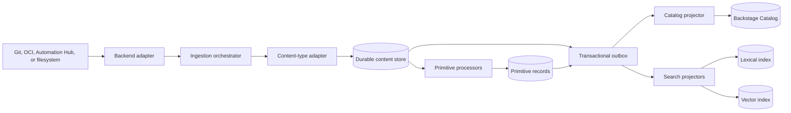
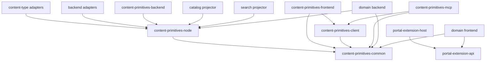

# Content Experience Architecture Refactoring and Migration Plan

## Document status

| Field                                      | Value                                                                                                 |
| ------------------------------------------ | ----------------------------------------------------------------------------------------------------- |
| Status                                     | Canonical proposed implementation plan                                                                |
| Primary architecture                       | `Content Experience Architecture & Integration Guide V3.md`, internally titled V4                     |
| Portal source repository                   | `ansible-backstage-plugins`                                                                           |
| Content proof-of-concept source repository | `automation-content-plugins`                                                                          |
| Portal inventory baseline                  | `feat/apme-eap-next-ui-workflow` at `f6c5bfe5aa5e6ad1eb8f66eecb41a0a32f29da80`                        |
| Proof-of-concept inventory baseline        | `ANSTRAT-1758-poc` at `6f372b47f33142931f5571a05a72c9ab44ea7947`                                      |
| Target outcome                             | Full current portal parity in the V4 package structure, with independently deliverable domain plugins |
| Intended reader                            | An implementation agent or engineer executing the migration                                           |

> **Important:** This is a migration plan, not a code-quality review. Preserve every capability listed in the parity matrices until its replacement passes the stated acceptance gate. Do not remove a route, action ID, permission, entity field, browser-state key, or dynamic artifact merely because the target implementation exists.

## Purpose

This plan refactors the existing Ansible portal and the `automation-content-plugins` proof of concept into the architecture defined by the V4 implementation guide. It assigns each current and planned capability to an explicit package, establishes dependency and persistence boundaries, and provides an ordered migration that avoids a flag day.

The implementation must achieve four outcomes:

1. Preserve current portal, AAP, SCM, Automation Hub, execution environment, scaffolder, and APME functionality.
2. Establish content-agnostic trust, intent, and quality primitives over Git, OCI, Automation Hub/Galaxy-Pulp, and filesystem sources.
3. Allow APME and future domains to register backend operations, entity UI, actions, and settings without direct imports in the portal composition root.
4. Give Portal UI, REST clients, Scaffolder, and MCP callers the same service behavior, authorization, and audit boundary.

## Scope

### In scope

- Package extraction, renaming, and responsibility changes across both repositories.
- Existing portal and APME capability parity.
- Git, OCI, Automation Hub/Galaxy-Pulp, and filesystem adapter placement.
- Content-type adapters and normalized content models.
- Catalog projection and search integration.
- Synchronous and asynchronous enrichment.
- Capability, entity tab, action, slot, column, and settings registration.
- Durable settings, reconciliation, primitive, job, event, and audit state.
- Normalized REST APIs and compatibility routes.
- Scaffolder integration and action compatibility.
- MCP translation over the normalized API.
- Dynamic plugin delivery, contract compatibility, rollout, and deprecation.

### Out of scope

- Rewriting sound OCI protocol logic solely to change coding style.
- Replacing Backstage Catalog, Search, Permission, or Scaffolder services.
- Defining the internal algorithms of future X2Ansible or Red Hat Edge products.
- Removing compatibility contracts before production parity is measured.
- Centralizing all domain settings in one database table. The settings shell is unified; storage remains owned by each domain.

## Source-of-truth rules

Use the following precedence when requirements conflict. This migration plan is the normative implementation reference for the current proposal; approval gates within it still require the named owner decisions before implementation:

1. This plan and explicit decisions approved while executing it.
2. The V4 implementation guide.
3. Existing public behavior and compatibility requirements in `ansible-backstage-plugins`.
4. The two-axis and digest-identity ADRs in `automation-content-plugins`.
5. Existing implementation details.

The file named `Content Experience Architecture & Integration Guide V3.md` has an internal V4 title; the historical filename is retained for link compatibility. It is the canonical conceptual guide, while this migration plan is authoritative when translating that architecture into implementation boundaries and work packages.

# Architecture decisions

## Preserve the two independent adapter axes

The guide describes backend adapters as backend service extensions. The implementation preserves the finer two-axis separation already proven in `automation-content-plugins`:

- A **backend adapter** implements read-oriented storage protocol behavior: discovery, immutable resolution, source-native metadata/trust-material access, bounded artifact reads, and change detection.
- A **content-type adapter** identifies and interprets content semantics.
- A **catalog projector** emits normalized objects as Backstage entities.
- A package such as `adapter-oci` may provide a Backstage provider integration, but protocol code must not become inseparable from Catalog.

Source mutations are not part of `BackendAdapter`. A source package may retain package-private protocol write primitives needed for compatibility, but push, tag, delete, and other external effects are exposed only by server-owned WP-012 operation handlers after WP-013 authorization, confirmation, audit, and exposure checks.

Automation Hub/Private Automation Hub is **not** an OCI source in the current portal. `PAHCollectionProvider` and `AAPClient` use Galaxy v3 and Pulp endpoints, including `/api/galaxy/v3/plugin/ansible/search/collection-versions/`; therefore it has an independent `adapter-automation-hub`. OCI remains a distinct Distribution v2 adapter. Collection interpretation remains in `content-type-collection-node` for either source.

The common pipeline is:



## Keep canonical state outside Catalog projections

Catalog annotations and relations remain the standard Backstage presentation mechanism, but they are projections. Durable content identity, evidence, primitive revisions, enrichment state, and operation jobs live in the content service database.

Asynchronous enrichers must not write Catalog annotations directly. They write a primitive record and an outbox event. A projector then updates Catalog and search indexes.

## Register operations, not arbitrary URLs

The guide's domain examples contain endpoint URLs in capability registrations. The implementation must replace this with typed server-side operation registrations:

- A backend plugin registers an `OperationDescriptor` and handler.
- REST, Scaffolder, UI, and MCP discover a serialized descriptor.
- Only the server holds the handler.
- Descriptors declare schemas, permission requirements, execution mode, exposure, and audit sensitivity.
- No domain plugin can use registration to create an unrestricted proxy.

## Align repository ownership with the guide

The final core package tree lives in `ansible-backstage-plugins`, parallel to the V4 guide. The existing `automation-content-plugins` repository is the source and validation environment for the OCI/EE proof of concept during migration.

After extraction:

- Core content contracts, services, adapters, generic UI, and MCP are released from `ansible-backstage-plugins`.
- Published NPM packages provide stable contracts to out-of-tree plugins.
- APME moves to an independently released dynamic-plugin repository after dual-registration parity.
- Partner templates remain in partner-owned SCM repositories.
- `automation-content-plugins` is either archived after history and ADR transfer or retained as a standalone integration harness that consumes published packages. It must not remain a second divergent implementation.

> **Decision gate:** Confirm the final disposition of `automation-content-plugins` before Phase 10. This does not block package extraction or compatibility work.

## Preserve domain ownership

The core platform owns generic contracts and invocation infrastructure. Domains own their algorithms and external services.

- APME owns projects, scans, violations, suppression, remediation, AI provider integration, Galaxy synchronization behavior, and domain settings.
- The content primitives service owns normalized quality, trust, intent, evidence, and dependency projections.
- AAP owns Controller resources and user-level authorization.
- Git and OCI sources own artifact bytes and mutable references.
- Backstage owns Catalog, Scaffolder task, Search, and RBAC databases.

# Target package and repository layout

## Core platform monorepo

Create or converge on this layout in `ansible-backstage-plugins`:

```text
plugins/
├── core/
│   ├── portal-theme/
│   ├── portal-auth-common/
│   ├── portal-auth-frontend/
│   ├── portal-scaffolder-frontend/
│   └── scaffolder-backend-module-portal/
├── portal-extension-common/
├── portal-extension-api/          # frontend API refs only
├── portal-extension-host/
├── content-primitives/
│   ├── content-primitives-common/
│   ├── content-primitives-permissions/
│   ├── content-primitives-client/
│   ├── content-primitives-node/
│   ├── content-primitives-backend/
│   ├── content-primitives-backend-module-trust/
│   ├── content-primitives-backend-module-quality-intent/
│   ├── content-primitives-frontend/
│   └── content-primitives-mcp/
├── backend-adapters/
│   ├── adapter-git/
│   ├── adapter-oci/
│   ├── adapter-automation-hub/
│   └── adapter-filesystem/
├── content-types/
│   ├── content-type-execution-environment-common/
│   ├── content-type-execution-environment-node/
│   ├── content-type-execution-environment-frontend/
│   └── content-type-collection-node/
├── catalog-backend-module-content-primitives/
├── search-backend-module-content-primitives/
├── scaffolder-backend-module-content-operations/
├── aap/
│   ├── aap-common/
│   ├── aap-node/
│   ├── aap-frontend/
│   ├── aap-backend/
│   ├── aap-backend-module-content-operations/
│   ├── auth-backend-module-aap-provider/
│   ├── catalog-backend-module-aap/
│   └── scaffolder-backend-module-aap/
└── content-compatibility/
```

Every leaf above is a separate `package.json` and a single Backstage runtime kind. No package may combine React/frontend entry points with a backend module, Express router, database migration, or Node-only client. `portal-extension-common` contains serializable descriptors; `portal-extension-api` contains frontend API refs; backend operation extension points remain in `content-primitives-node`. Physical moves may happen after APIs stabilize, but these runtime boundaries, package names, and public contracts must be established first.

`content-primitives-backend-module-trust` uses module ID `trust-processors`, and `content-primitives-backend-module-quality-intent` uses module ID `quality-intent-processors`; both target backend plugin ID `content-primitives`. They are Node-only processor contribution packages. They register through `content-primitives-node` extension points and never own the normalized router, durable jobs, or primitive persistence.

## Domain plugin repositories

The first extraction target is an APME repository with this conceptual layout:

```text
plugins/
├── apme-common/
├── apme-client/                   # browser/Node-safe authenticated client for plugin ID `apme`
├── apme-backend/                  # standalone plugin ID `apme`; `/apme` router, DB and scheduler
├── apme-backend-module-content-operations/ # module ID `apme`, target plugin ID `content-primitives`
├── apme-backend-module-content-processors/ # module ID `apme-processors`, target plugin ID `content-primitives`
├── catalog-backend-module-apme-compatibility/ # module ID `apme-compatibility`, target `catalog`; legacy route mount only
├── apme-frontend/
└── apme-scaffolder/       # only for actions that cannot use the generic operation bridge
```

Future X2Ansible, Edge, and partner code-backed integrations follow the same pattern. Declarative templates do not require these packages.

`apme-common` is dependency-light wire schemas/descriptors and APME result-event schemas only. `apme-client` is the sole request/response cross-plugin transport into plugin ID `apme`; `apme-backend-module-content-operations` is the sole operation-registration package; `apme-backend-module-content-processors` consumes authenticated APME result events and registers APME primitive processors without owning persistence; `catalog-backend-module-apme-compatibility` is the sole legacy Catalog route owner.

# Package capability reference

## Core packages

| Target package                          | Mission                                                   | Owned capabilities                                                                   | Public surface                             | Must not own                               | Migrates from                                         |
| --------------------------------------- | --------------------------------------------------------- | ------------------------------------------------------------------------------------ | ------------------------------------------ | ------------------------------------------ | ----------------------------------------------------- |
| `core/portal-theme`                     | Render the portal shell and Ansible visual identity       | Layout, global header/sidebar, themes, base navigation, shared feedback placement    | Frontend theme and shell extension exports | Content semantics, APME UI, source clients | `packages/app`, `backstage-rhaap` shell and branding  |
| `core/portal-auth-common`               | Define portable identity and credential-routing contracts | Principal classes, credential request policy, logout event                           | Browser/Node-safe types                    | Provider implementation or token storage   | Shared auth contracts                                 |
| `core/portal-auth-frontend`             | Integrate portal sign-in/logout behavior                  | Provider settings, logout UI, browser cleanup                                        | Frontend extensions                        | Backend resolvers or raw token persistence | `self-service` AAP logout and app sign-in composition |
| `core/portal-scaffolder-frontend`       | Own generic Golden Path UX                                | Template browse/details, forms, task history, safe OAuth restoration, generic fields | Frontend routes and field extensions       | Backend actions or AAP resource lifecycle  | `self-service` template/task UX                       |
| `core/scaffolder-backend-module-portal` | Own generic Ansible generation actions                    | Content generation, prepare-for-publish, generic filters                             | Backstage backend module                   | React and AAP resource lifecycle logic     | Generic actions/filters from scaffolder RHAAP module  |

## AAP domain packages

| Target package                              | Runtime                                                                | Owned capabilities                                                                                                                                                                                                    | Migrates from                                                          |
| ------------------------------------------- | ---------------------------------------------------------------------- | --------------------------------------------------------------------------------------------------------------------------------------------------------------------------------------------------------------------- | ---------------------------------------------------------------------- |
| `aap/aap-common`                            | portable                                                               | Controller/Hub DTOs, AAP permissions, entity annotation contracts, API refs without React/Node dependencies                                                                                                           | `backstage-rhaap-common` interfaces/types/constants/permissions        |
| `aap/aap-node`                              | Node library                                                           | Portable `IAAPService` declaration, typed authenticated AAP REST client, delegation/context interfaces, and SCM client contracts used by AAP operations; no Controller client implementation or credential resolution | `backstage-rhaap-common` AAPClient/AAPService and server-only SCM code |
| `aap/aap-backend`                           | backend plugin, plugin ID `aap`                                        | Controller client application service; delegated user/service/scheduler credential acquisition, refresh, revocation, and selection; service endpoint used by the operation module; no operation registry ownership    | Newly extracted from catalog/scaffolder modules                        |
| `aap/aap-backend-module-content-operations` | backend module, module ID `aap`, target plugin ID `content-primitives` | Registers typed AAP operation descriptors/handlers; handlers call `aap-backend` through the authenticated `aap-node` REST client and never construct Controller clients or credentials                                | Newly extracted from catalog/scaffolder modules                        |
| `aap/auth-backend-module-aap-provider`      | backend module                                                         | AAP OAuth provider, profile exchange, sign-in resolver                                                                                                                                                                | `auth-backend-module-rhaap-provider`                                   |
| `aap/catalog-backend-module-aap`            | backend module                                                         | Organization/team/user/job-template providers, AAP sync and entity projection                                                                                                                                         | AAP-owned portions of `catalog-backend-module-rhaap`                   |
| `aap/scaffolder-backend-module-aap`         | backend module                                                         | Existing `rhaap:*` action wrappers and `aap-api-cloud` autocomplete over registered operations                                                                                                                        | AAP-owned portions of scaffolder RHAAP module                          |
| `aap/aap-frontend`                          | frontend plugin                                                        | `/ansible` overview, AAP auth UI, AAP resource fields, logout, Controller-specific cards/routes                                                                                                                       | `backstage-rhaap` and AAP-specific portions of `self-service`          |

## Extension packages

| Target package            | Mission                                         | Owned capabilities                                                                                                                   | Public surface                              | Must not own                                     | Migrates from                                                               |
| ------------------------- | ----------------------------------------------- | ------------------------------------------------------------------------------------------------------------------------------------ | ------------------------------------------- | ------------------------------------------------ | --------------------------------------------------------------------------- |
| `portal-extension-common` | Give plugins stable serializable host contracts | Capability, entity tab/action, overview slot, column, menu, overlay, and settings descriptors; applicability and permission metadata | Dependency-light TypeScript/runtime schemas | React components, host state, operation handlers | Neutral parts of `GitRepositoriesPageTabDefinition` and related definitions |
| `portal-extension-api`    | Give frontend dynamic plugins stable API refs   | Shared frontend API refs and typed React contribution contracts                                                                      | Frontend NPM exports                        | Backend operation handlers or persistence        | `GitRepositoriesExtensionsApi` and frontend contribution types              |
| `portal-extension-host`   | Aggregate and render all contributions          | Multi-provider registries, ordering, conflict detection, applicability evaluation, permission-aware hiding, no-provider fallbacks    | Host APIs and shell components              | Domain business logic or settings storage        | `useGitRepositoriesExtensions`, app/entity static composition               |

## Content primitive packages

| Target package                   | Mission                                                                       | Owned capabilities                                                                                                                                                  | Public surface                                                     | Persistence                                              | Must not own                                                                     | Migrates from                                                                   |
| -------------------------------- | ----------------------------------------------------------------------------- | ------------------------------------------------------------------------------------------------------------------------------------------------------------------- | ------------------------------------------------------------------ | -------------------------------------------------------- | -------------------------------------------------------------------------------- | ------------------------------------------------------------------------------- |
| `content-primitives-common`      | Define portable wire and model contracts                                      | Content identity, source, lifecycle, trust/intent/quality primitive schemas, evidence, provenance, relations, REST DTOs, events, operations, runtime schemas        | Dependency-light NPM exports and JSON schemas                      | None                                                     | React, Backstage, Express, protocol clients                                      | `content-model`; duplicated backend/frontend DTOs                               |
| `content-primitives-permissions` | Define public Backstage authorization contracts for content and sources       | Content/source permission objects, resource types, resource-ref schemas and conditional-rule factories                                                              | Browser/Node-safe Backstage permission exports                     | None                                                     | UI, handlers, policy decisions, source credentials                               | Existing generic Ansible permissions plus new source-administration permissions |
| `content-primitives-client`      | Call the normalized content API from any supported consumer                   | Generated/typed REST client, request/response decoding, pagination, job/SSE helpers, identity-forwarding hooks supplied by the caller                               | Browser/Node-safe client exports over `content-primitives-common`  | None                                                     | Backend implementation, database, adapters, MCP protocol, React                  | PoC API client and duplicated frontend fetch wrappers                           |
| `content-primitives-node`        | Define server-side extension and orchestration SDKs                           | Backend/content-type adapter interfaces, registries, processor/enricher APIs, repositories, projector contracts, operation handler types                            | Node NPM exports and Backstage backend extension points            | None                                                     | OCI implementation, APME algorithms, React                                       | Neutral pieces of `automation-content-common`                                   |
| `content-primitives-backend`     | Run the content application service as backend plugin ID `content-primitives` | Ingestion orchestration, durable stores, primitive processing, enrichment jobs, outbox, normalized API, operation invocation, audit emission, reconcile/drift state | `/v1` API and backend extension points                             | PostgreSQL; evidence references/object storage as needed | Direct React rendering; direct MCP protocol handling                             | `automation-content-backend`; shared RHAAP sync orchestration concepts          |
| `content-primitives-frontend`    | Render reusable content and primitive experiences                             | Content browser, trust badge, provenance view, intent facets, quality graphs, compatibility and dependency panels                                                   | React components and frontend API client binding                   | Browser query cache only                                 | Domain settings, direct adapter calls                                            | `automation-content` generic views; reusable pieces of RHAAP/self-service       |
| `content-primitives-mcp`         | Translate MCP calls to the normalized application API                         | Stable tools, dynamic approved operation tools, identity propagation, result shaping                                                                                | MCP server/tool definitions using `content-primitives-client` only | No domain state                                          | Business logic, backend implementation imports, direct DB/adapter/Catalog access | New                                                                             |

## Backend adapters

| Target package           | Mission                                    | Required capabilities                                                                                                                                                                                            | Prohibited responsibilities                                                                 | Migrates from                                                              |
| ------------------------ | ------------------------------------------ | ---------------------------------------------------------------------------------------------------------------------------------------------------------------------------------------------------------------- | ------------------------------------------------------------------------------------------- | -------------------------------------------------------------------------- |
| `adapter-git`            | Discover and read content from SCM         | GitHub/GitLab and Gitea; organizations/repos/refs; marker and file reads; immutable commit resolution; webhook/poll input; CI metadata through an optional capability                                            | Collection or APME semantics; Catalog-owned entity construction                             | `AnsibleGitContentsProvider`, SCM clients, file-content and CI route logic |
| `adapter-oci`            | Discover and read OCI artifacts            | Distribution v2 client, auth, probing, pagination, digest resolution/cache, native/fallback referrers, manifests/blobs, and package-private compatibility write primitives not exported through `BackendAdapter` | EE-specific interpretation; direct mutation exposure; duplicate index/catalog orchestration | OCI code from `automation-content-common` and OCI provider mechanics       |
| `adapter-automation-hub` | Discover Automation Hub/Galaxy collections | Galaxy v3 collection-version search, Pulp repository/content/documentation APIs, token auth, repository filters, pagination, sync/poll and diagnostics                                                           | OCI Distribution assumptions; collection semantic normalization; AAP Controller resources   | `PAHCollectionProvider` and Galaxy/Pulp methods currently in `AAPClient`   |
| `adapter-filesystem`     | Discover local or mounted content          | Root allowlists, recursive discovery, hashing, marker reads, watch/poll, symlink and traversal safety                                                                                                            | SCM/OCI assumptions; unrestricted paths                                                     | New                                                                        |

## Content-type packages

| Target package                                | Runtime                                     | Mission and owned semantics                                                                                                                                                              | Public surface/registration                                            | Migrates from                                                                                                 |
| --------------------------------------------- | ------------------------------------------- | ---------------------------------------------------------------------------------------------------------------------------------------------------------------------------------------- | ---------------------------------------------------------------------- | ------------------------------------------------------------------------------------------------------------- |
| `content-type-execution-environment-common`   | portable                                    | EE identity, DTOs, annotations, relations and update-policy vocabulary                                                                                                                   | Dependency-light schemas/constants                                     | Portable parts of existing EE adapter and UI contracts                                                        |
| `content-type-execution-environment-node`     | Node library/backend extension contribution | EE detection, normalization and manifest-based enumeration using declared source capabilities; never hardcode `backendId: 'oci'`                                                         | Content-type contribution registered through `content-primitives-node` | Existing `ExecutionEnvironmentAdapter`; its current OCI backend ID is migration input, not a neutral contract |
| `content-type-execution-environment-frontend` | frontend plugin/library                     | EE detail/documentation widgets, content cards and frontend API binding                                                                                                                  | React exports and dynamic frontend contributions                       | EE-specific components from both repositories                                                                 |
| `content-type-collection-node`                | Node library/backend extension contribution | Independently addressable collection identity, Galaxy metadata, plugins/roles/playbooks/rulebooks, documentation and relations over Git, OCI, Automation Hub, or filesystem capabilities | Content-type contribution registered through `content-primitives-node` | Collection parsing from both repositories                                                                     |

Additional content types must be separate packages when they add semantics, lifecycle, or UI substantial enough to require independent ownership.

# Complete package disposition ledger

This ledger is exhaustive for package manifests present at the pinned baselines. A package is not deleted when its target is created; its compatibility owner retains its name/entry points until the deletion gate passes. `packages/app` and `packages/backend` are composition roots, not capability dumping grounds.

## `ansible-backstage-plugins` packages

| Current manifest/package                                       | Capability disposition                                                                        | Target package(s)                                                                                                                                                                                                                                                                                                                                                                                   | Phase/compatibility owner | Deletion or convergence gate                                                                                                                                            |
| -------------------------------------------------------------- | --------------------------------------------------------------------------------------------- | --------------------------------------------------------------------------------------------------------------------------------------------------------------------------------------------------------------------------------------------------------------------------------------------------------------------------------------------------------------------------------------------------- | ------------------------- | ----------------------------------------------------------------------------------------------------------------------------------------------------------------------- |
| `packages/app`                                                 | Keep as thin frontend composition root; remove domain implementation imports                  | `portal-theme`, extension host, installed frontend plugins                                                                                                                                                                                                                                                                                                                                          | P7–P9 / Portal            | Static and dynamic route/field/sign-in parity matrix passes; no APME implementation import                                                                              |
| `packages/backend`                                             | Keep as thin backend composition root; install backend modules only                           | Content, AAP, auth, search, Scaffolder modules                                                                                                                                                                                                                                                                                                                                                      | P2–P10 / Portal           | No direct adapter/domain handler registration outside module installation                                                                                               |
| `@ansible/backstage-rhaap-common`                              | Split portable contracts from Node services; retain re-export façade                          | `aap-common`, `aap-node`                                                                                                                                                                                                                                                                                                                                                                            | P1/P8 / AAP               | All consumers use runtime-correct target; old exports have measured zero use and removal version                                                                        |
| `@ansible/plugin-backstage-rhaap`                              | Split branding/shell from AAP overview                                                        | `portal-theme`, `aap-frontend`                                                                                                                                                                                                                                                                                                                                                                      | P7/P8 / AAP frontend      | `/ansible`, icon, listener, menu and overview parity; dynamic install passes                                                                                            |
| `@ansible/plugin-backstage-self-service`                       | Split generic Scaffolder UX, generic content UI, EE/collection UI, Git UI, AAP fields/auth UI | `portal-scaffolder-frontend`, `content-primitives-frontend`, `content-type-execution-environment-frontend`, `aap-frontend`, extension host                                                                                                                                                                                                                                                          | P7/P8 / Portal            | Every export/dynamic registration has a target; old routes are aliases; browser-state suite passes                                                                      |
| `@ansible/backstage-plugin-auth-backend-module-rhaap-provider` | Rename/converge as AAP auth module                                                            | `auth-backend-module-aap-provider`                                                                                                                                                                                                                                                                                                                                                                  | P8 / AAP auth             | Provider ID/resolvers/config/login/logout parity on supported RHDH versions                                                                                             |
| `@ansible/backstage-plugin-catalog-backend-module-rhaap`       | Split AAP Controller, Automation Hub, Git, EE, compatibility routing, and projection          | `catalog-backend-module-aap`, `adapter-automation-hub`, `adapter-git`, EE type/projector, `content-compatibility`                                                                                                                                                                                                                                                                                   | P2–P8 / Catalog+AAP       | Route ledger passes; each provider location key has one owner; no PAH code in OCI adapter                                                                               |
| `@ansible/plugin-scaffolder-backend-module-backstage-rhaap`    | Split generic actions from AAP operations/wrappers                                            | `scaffolder-backend-module-portal`, `scaffolder-backend-module-aap`, content operation bridge                                                                                                                                                                                                                                                                                                       | P8 / Scaffolder+AAP       | All action/filter/autocomplete IDs and outputs pass contract fixtures                                                                                                   |
| `@ansible/backstage-apme-common`                               | Move unchanged first, then consume platform contracts                                         | `apme-common` in APME repository                                                                                                                                                                                                                                                                                                                                                                    | P9 / APME                 | Published cross-version contract tests pass and no core-only imports                                                                                                    |
| `@ansible/plugin-backstage-apme`                               | Move to independent dynamic frontend                                                          | `apme-frontend`                                                                                                                                                                                                                                                                                                                                                                                     | P9 / APME                 | Exact API factory/entity-tab/card registration, local state, and removal tests pass                                                                                     |
| `@ansible/backstage-plugin-catalog-backend-module-apme`        | Split domain backend from Catalog projector bridge; migrate file state                        | standalone `apme-backend` plugin (plugin ID `apme`, domain `/api/apme` router, DB/scheduler), `apme-backend-module-content-operations` (module ID `apme`, target plugin ID `content-primitives`), `apme-backend-module-content-processors` (module ID `apme-processors`, target plugin ID `content-primitives`), Catalog-targeted `catalog-backend-module-apme-compatibility`, and projector bridge | P9 / APME                 | All 36 route declarations map to operations/aliases; exact `/api/catalog/apme/*` mount, DB import, module registration, primitive normalization, and replica tests pass |

## `automation-content-plugins` packages

| Current manifest/package                                    | Capability disposition                                                               | Target package(s)                                                                                                                     | Phase/compatibility owner | Deletion or convergence gate                                                                                 |
| ----------------------------------------------------------- | ------------------------------------------------------------------------------------ | ------------------------------------------------------------------------------------------------------------------------------------- | ------------------------- | ------------------------------------------------------------------------------------------------------------ |
| `@ansible/content-model`                                    | Move portable Level A/B identity, enumeration and relation contracts                 | `content-primitives-common`                                                                                                           | P1 / Content platform     | Cross-version fixtures pass; old package becomes re-export or harness dependency                             |
| `@ansible/automation-content-common`                        | Split neutral Node contracts from concrete OCI protocol                              | `content-primitives-node`, `adapter-oci`                                                                                              | P1/P2 / Content platform  | Forbidden-import tests pass; no neutral contract names OCI                                                   |
| `@ansible/content-type-execution-environment`               | Split EE semantics by runtime and remove backend-ID checks                           | `content-type-execution-environment-common`, `content-type-execution-environment-node`, `content-type-execution-environment-frontend` | P2/P7 / EE owner          | Same digests/classification/enumeration fixtures across old/new adapters plus dynamic UI registration parity |
| `@ansible/plugin-automation-content-backend`                | Replace in-memory API/index authority with application service; retain route aliases | `content-primitives-backend`, `content-compatibility`                                                                                 | P2–P4 / Content platform  | All 20 route declarations pass compatibility ledger; durable restart test passes                             |
| `@ansible/plugin-catalog-backend-module-automation-content` | Convert provider/index projection into one projector over ingestion output           | `catalog-backend-module-content-primitives`                                                                                           | P2/P6 / Catalog           | Catalog and API converge from one observation set; old provider no longer discovers independently            |
| `@ansible/plugin-automation-content`                        | Move generic browser/clients; EE UI remains type owned                               | `content-primitives-client`, `content-primitives-frontend`, `content-type-execution-environment-frontend`                             | P7 / Content frontend     | Route and result parity, dynamic install, and normalized-client tests pass                                   |
| PoC `packages/app`/`packages/backend` composition           | Convert to published-package integration harness or archive                          | Harness only; no production capability owner                                                                                          | P11 / Repository owners   | WP-040 decision approved; ADR/history retained and no divergent source implementation                        |

## Export and runtime registration control

WP-001 must generate, not hand-maintain, four manifests from each pinned source: (1) every `src/index.ts` and `src/dynamic/index.ts` export, (2) every backend `backend.add(import(...))`, module/plugin ID and extension-point registration, (3) every frontend route/API factory/mount point/menu/entity contribution/field extension, and (4) every package `exports` entry. Each row records `current symbol or ID`, `runtime`, `target package/symbol`, `compatibility alias`, `contract test`, `owner`, and `removal release`. CI fails if source exports or registrations appear without a ledger row. This generated manifest is the authoritative symbol-level complement to the package ledger above.

## Projection and bridge packages

| Target package                                 | Mission                                                                 | Owned capabilities                                                                                            | Migrates from                                                            |
| ---------------------------------------------- | ----------------------------------------------------------------------- | ------------------------------------------------------------------------------------------------------------- | ------------------------------------------------------------------------ |
| `catalog-backend-module-content-primitives`    | Project canonical content and selected primitive summaries into Catalog | Entity provider/projector, stable annotations, standard relations, legacy aliases                             | Both current content catalog providers and learned-dependency projection |
| `search-backend-module-content-primitives`     | Build lexical and semantic search projections                           | Backstage Search collator, search documents, embedding jobs/index adapter                                     | New; reuses existing Backstage Search infrastructure                     |
| `scaffolder-backend-module-content-operations` | Expose approved operations to Scaffolder                                | Descriptor filtering, schema mapping, identity/audit forwarding, async job handling                           | Generic portions of existing action implementations                      |
| `content-compatibility`                        | Preserve old contracts during migration                                 | Route aliases, action wrappers, annotation dual reads/writes, entity aliases, metrics and deprecation headers | Existing routes/action IDs and transitional code                         |

# Dependency rules



Enforce these rules with repository tests:

1. `content-primitives-common` has no React, Backstage, Express, database, or transport dependencies.
2. `content-primitives-node` has no concrete Git, OCI, filesystem, AAP, or APME client.
3. Backend adapters contain no Ansible content-type branching.
4. Content-type adapters use declared backend capabilities, not backend IDs.
5. Frontends, MCP, and Scaffolder never query adapters or persistence directly.
6. `content-primitives-mcp` communicates with content/operation services only through the normalized REST client; it cannot import `content-primitives-backend` or call an in-process service implementation.
7. Catalog entities and annotations are not canonical primitive storage.
8. Domain plugins import published contracts, not host implementation internals.
9. A dynamic action references an operation ID rather than embedding an unrestricted endpoint.
10. A settings registration owns UI/navigation metadata, not another domain's persistence.
11. The core app and backend composition roots contain no APME component or handler imports after extraction.

# Canonical contracts

## Content subject

Every durable content, primitive, operation, search, and audit record uses a stable content subject. Mutable tags are observations, never identity keys.

Required fields:

| Field              | Required | Description                                                      |
| ------------------ | -------- | ---------------------------------------------------------------- |
| `contentKey`       | Yes      | Stable logical key including source and normalized identity      |
| `digest`           | Yes      | Immutable digest of the observed artifact or source tree         |
| `variant`          | No       | Optional contained item or platform variant                      |
| `source.backendId` | Yes      | Adapter instance that observed the content                       |
| `source.uri`       | Yes      | Canonical source URI                                             |
| `observedRef`      | No       | Mutable tag, branch, or friendly reference observed at ingestion |

## Primitive record

A primitive is a versioned result with evidence and provenance, not a single mutable annotation.

Required semantic states:

- `known`
- `unknown`
- `not_scanned`
- `partial`
- `failed`

Every record includes:

- subject and digest;
- primitive namespace, name, and schema version;
- value when known;
- evidence URI/digest/media type references;
- producer ID and version;
- run and input digests;
- generation time and optional validity horizon;
- optional confidence and superseded-record link.

## Trust primitive family

| Primitive            | Initial source/processor                  | Catalog projection                   |
| -------------------- | ----------------------------------------- | ------------------------------------ |
| Certification status | Automation Hub/partner metadata           | Certification annotation and label   |
| Publisher identity   | Source identity resolver                  | Verified publisher annotation        |
| Signing status       | Signature provider                        | Signing state annotation             |
| Provenance chain     | Build manifest and source relations       | Summary annotation plus relations    |
| Security scan        | Trivy/Grype or approved scanner           | Severity summary annotations         |
| Behavioral testing   | Test harness integration                  | Pass/fail/coverage summary           |
| Dependency health    | Relation graph and primitive reducer      | Health summary                       |
| Support boundary     | Source metadata/policy                    | Support annotation                   |
| Content freshness    | Source and release observations           | Freshness timestamp/state            |
| Trust score          | Versioned policy over other trust records | Score and policy-version annotations |

Do not hardcode a permanent score formula. Store the policy ID/version and component evidence so a score can be recomputed.

## Intent primitive family

| Primitive              | Initial source/processor                                  | Search use                   |
| ---------------------- | --------------------------------------------------------- | ---------------------------- |
| Business use cases     | Native metadata, curated values, optional AI enrichment   | Facet and semantic text      |
| Target infrastructure  | Native metadata and collection/plugin facts               | Facet                        |
| Compliance alignment   | Curated/verified claims; AI suggestions remain unverified | Facet with evidence state    |
| Capability definitions | Content enumeration and curated mappings                  | Facet and operation matching |
| Content intent         | Native description, docs, optional AI summary             | Semantic text                |
| Industry verticals     | Curated/AI-assisted taxonomy                              | Facet                        |

AI-generated values must include provenance, confidence, model version, and verification state. Never present an unverified compliance suggestion as a verified claim.

## Quality primitive family

| Primitive            | Initial source/processor                      | Catalog projection                    |
| -------------------- | --------------------------------------------- | ------------------------------------- |
| Code quality         | Lint/static checks and APME normalized output | Score/status                          |
| Documentation        | Manifest/docs completeness processor          | Score/status                          |
| Test coverage        | Native reports or harness                     | Coverage/status                       |
| Structure compliance | Synchronous lightweight validation            | Score/status                          |
| Maintenance signals  | SCM activity/release observations             | Summary                               |
| Compatibility matrix | Metadata and validation runs                  | Compact status; details remain in API |

## Operation descriptor

Each capability uses an operation descriptor with:

- globally unique ID and semantic version;
- title and description;
- query or command mode;
- synchronous or asynchronous execution;
- JSON input and output schemas;
- permission and resource declaration;
- resource derivation from input;
- REST/UI/Scaffolder/MCP exposure flags;
- audit category and sensitivity;
- owner and support metadata;
- idempotency behavior for commands;
- cancellation support for jobs;
- minimum host contract version.

Backend registration includes the handler. Client discovery returns metadata only.

## Frontend contribution contracts

Support multiple simultaneous contributions for:

- entity tabs;
- entity actions;
- overview slots/cards;
- page tabs;
- table columns;
- row and header menu items;
- persistent overlays/dialog hosts;
- settings sections.

Each contribution declares:

- stable ID;
- owner plugin;
- title/category/order;
- supported entity kinds/types;
- serializable applicability expression where possible;
- optional permission/resource requirement;
- React component or operation ID as appropriate;
- minimum host API version.

Registry behavior must be deterministic. Reject duplicate IDs with diagnostics, preserve zero-provider fallbacks, and isolate a failing contribution so it cannot break the host page.

# Application service and API design

## Service boundary

Implement these backend services before moving consumers:

| Service                    | Responsibility                                                         |
| -------------------------- | ---------------------------------------------------------------------- |
| `ContentIngestionService`  | Coordinate backend and content-type adapters and persist observations  |
| `ContentQueryService`      | Read normalized content and contained items                            |
| `PrimitiveService`         | Read/write versioned primitive records and evidence                    |
| `EnrichmentService`        | Request, deduplicate, retry, and inspect enrichment jobs               |
| `OperationService`         | Register, discover, authorize, invoke, and monitor operations          |
| `CatalogProjectionService` | Convert content/primitive events into Backstage entities and relations |
| `SearchProjectionService`  | Build lexical documents and embeddings                                 |
| `AuditService`             | Emit normalized allowed, denied, completed, and failed audit records   |

## Versioned REST surface

Use a dedicated Backstage backend plugin ID rather than the Catalog namespace. The exact external prefix depends on Backstage routing, but the application contract is:

```text
GET  /v1/content
GET  /v1/content/{contentKey}
GET  /v1/content/{contentKey}/contents
GET  /v1/content/{contentKey}/primitives
GET  /v1/content/{contentKey}/provenance
GET  /v1/collections
GET  /v1/collections/{namespace}/{name}
GET  /v1/content-items
GET  /v1/content-items/{fqcn}
POST /v1/search
POST /v1/intent:resolve
POST /v1/requirements:resolve
GET  /v1/operations
GET  /v1/operations/{operationId}
POST /v1/operations/{operationId}:invoke
GET  /v1/operations/jobs/{jobId}
POST /v1/operations/jobs/{jobId}:cancel
```

Generate or validate OpenAPI from the shared runtime schemas. Frontend, scripts, and MCP consume the same DTO package/client.

## Shared invocation pipeline

Every UI, REST, Scaffolder, or MCP operation follows this order:

1. Authenticate the user or approved service principal.
2. Validate input against the descriptor schema.
3. Resolve the resource and content subject.
4. Authorize the declared permission and conditional resource rule.
5. Enforce `catalog.entity.read` when the subject has a Catalog projection.
6. Apply deployment policy and exposure allowlists.
7. Invoke synchronously or create an asynchronous job.
8. Persist result and transactional outbox entries.
9. Emit redacted success or failure audit data.

Denied invocations are audited. Bearer tokens, SCM tokens, provider secrets, uploaded secret fields, and AI provider credentials are never persisted in jobs or audit payloads.

# Persistence and state ownership

| State                                            | Authoritative owner                         | Target storage                                                               | Migration source                                                |
| ------------------------------------------------ | ------------------------------------------- | ---------------------------------------------------------------------------- | --------------------------------------------------------------- |
| Source bytes and tags/branches                   | Git, OCI, filesystem                        | External source                                                              | Existing integrations                                           |
| Content observations and immutable identity      | Content backend                             | PostgreSQL                                                                   | `ContentIndex` memory and provider-derived state                |
| Reconcile history and tag-to-digest drift        | Content backend                             | PostgreSQL                                                                   | OCI index/provider memory                                       |
| Metadata cache                                   | Content backend                             | Digest-keyed cache/object storage                                            | `DigestCache`                                                   |
| Content manifests                                | Source plus normalized content backend copy | OCI/source and PostgreSQL/object storage                                     | OCI referrers and manifest reader                               |
| Primitive records/evidence/provenance            | Content backend                             | PostgreSQL plus object storage references                                    | New; normalized from APME and other processors                  |
| Enrichment and operation jobs                    | Content/domain backend                      | PostgreSQL or durable queue                                                  | APME operation state and new jobs                               |
| Event outbox/idempotency                         | Producing backend                           | PostgreSQL transactional outbox                                              | New                                                             |
| Catalog entities/annotations/relations           | Backstage Catalog                           | Catalog database projection                                                  | Current providers                                               |
| Lexical search documents                         | Search module                               | Backstage Search PostgreSQL initially                                        | New integration                                                 |
| Embeddings                                       | Search module                               | `pgvector` initially                                                         | New                                                             |
| APME projects/scans/findings                     | APME Gateway                                | Gateway-owned storage                                                        | Unchanged                                                       |
| APME portal settings/overrides/activity outcomes | APME backend                                | Backstage `DatabaseService`, APME schema                                     | JSON file store                                                 |
| APME scheduler cursor                            | APME backend                                | Database row with locking                                                    | In-memory map                                                   |
| Browser workflow restoration                     | Owning frontend                             | `sessionStorage`, secret-redacted                                            | Existing self-service keys                                      |
| APME selected workflow AI model                  | APME frontend with server default           | `AI_MODEL_STORAGE_KEY` in `localStorage` plus APME global `defaultAiModelId` | Existing behavior; server setting takes precedence when present |
| Governance approvals                             | Owning policy service                       | Digest-keyed PostgreSQL                                                      | New/future                                                      |
| Audit                                            | Platform audit service                      | Append-only sink with reliable outbox                                        | Existing logs plus new contract                                 |

# Current capability parity map

## Portal shell and identity

| Existing capability                                                 | Current location                     | Target owner                                                                                                                                                           | Compatibility and verification                                                                                  |
| ------------------------------------------------------------------- | ------------------------------------ | ---------------------------------------------------------------------------------------------------------------------------------------------------------------------- | --------------------------------------------------------------------------------------------------------------- |
| Global header, sidebar, layout, themes, branding                    | `packages/app`, `backstage-rhaap`    | `core/portal-theme`                                                                                                                                                    | Visual regression and route-navigation tests                                                                    |
| Ansible overview, favourites, quick access, learning links          | `backstage-rhaap`                    | `aap-frontend` owns the `/ansible` route component, overview/card composition, favourites and learning links; `portal-theme` owns only shell navigation/icon placement | Preserve exact route, cards, favourites persistence, links, permission behavior and static/dynamic registration |
| Base Catalog, TechDocs, Search, API Explorer, RBAC, settings routes | `packages/app`                       | Portal composition root                                                                                                                                                | Route smoke suite; no behavior move unless required                                                             |
| AAP OAuth, profile exchange, sign-in resolver                       | `auth-backend-module-rhaap-provider` | `portal-auth-common` and `auth-backend-module-aap-provider`                                                                                                            | Existing resolver tests plus login/logout E2E                                                                   |
| Optional sign-in for new AAP users                                  | Auth and RHAAP catalog route         | AAP auth/domain module through hardened service operation                                                                                                              | Preserve configured behavior; remove open mutation path                                                         |
| AAP logout, revoke, browser cleanup                                 | `self-service`                       | `portal-auth-frontend` plus `aap-frontend` integration                                                                                                                 | Browser E2E verifies session/token cleanup                                                                      |
| Permission-aware sidebar and routes                                 | `self-service`, app                  | `portal-extension-host` plus current permission API                                                                                                                    | Unauthorized routes hidden and deep links rejected                                                              |

## Catalog and discovery

| Existing capability                                        | Current location                         | Target owner                                                           | Compatibility and verification                                                                   |
| ---------------------------------------------------------- | ---------------------------------------- | ---------------------------------------------------------------------- | ------------------------------------------------------------------------------------------------ |
| AAP organizations, teams, users                            | `AAPEntityProvider`                      | AAP dynamic backend provider                                           | Entity snapshot and membership parity                                                            |
| AAP superuser annotation and `aap-admins` membership       | RHAAP entity parser/provider             | AAP provider                                                           | Contract fixture verifies exact mapping                                                          |
| AAP job templates and surveys as Backstage Templates       | `AAPJobTemplateProvider`                 | AAP catalog module plus `portal-scaffolder-frontend`                   | Generated template snapshot and launch E2E                                                       |
| PAH collections by repository                              | `PAHCollectionProvider`                  | `adapter-automation-hub` plus `content-type-collection-node`           | Galaxy/Pulp response, entity, metadata, repository, and documentation parity; explicitly not OCI |
| GitHub/GitLab organization, repo, branch, and tag crawling | `AnsibleGitContentsProvider`             | `adapter-git` plus ingestion service                                   | Fixture reconciliation and ref parity                                                            |
| Configurable `galaxy.yml` paths/depth                      | Git provider                             | `content-type-collection-node` discovery markers and Git adapter reads | Config contract tests                                                                            |
| Collection identity and version deduplication              | RHAAP parser/provider                    | Content model/type adapter/projector                                   | Dual-run entity diff                                                                             |
| Repository-to-collection linkage                           | Provider annotations                     | Catalog projector standard relations plus legacy annotations           | Relation and old UI lookup tests                                                                 |
| Manual repository registration/deregistration              | `ManualGitRepositoryProvider` and routes | Content registration operation plus Git adapter/projector              | Preserve delta-only ownership and manual-only delete rule                                        |
| EE entity registration                                     | `EEEntityProvider`                       | EE type adapter/projector                                              | Existing producer can call compatibility operation                                               |
| Sync status, counts, deltas, timestamps, conflicts         | RHAAP routes/providers                   | Durable ingestion jobs and compatibility response adapter              | Old response contract tests and restart test                                                     |
| Learned dependencies and canonical matching                | `ApmeLearnedDepsEntityProvider`          | APME enricher to primitive relation records, Catalog projector         | Emit normalized relations and legacy synthetic entities during transition                        |
| OCI repository/tag/referrer discovery                      | Automation PoC provider/index            | `adapter-oci` and ingestion service                                    | Existing OCI tests plus one-pipeline convergence test                                            |
| Honest exact/unknown enumeration provenance                | Automation content model/index           | Common model and primitive backend                                     | Preserve all status distinctions in API and UI                                                   |

## Self-service and content experiences

| Existing capability                                 | Current location                    | Target owner                                                                             | Compatibility and verification                                               |
| --------------------------------------------------- | ----------------------------------- | ---------------------------------------------------------------------------------------- | ---------------------------------------------------------------------------- |
| Template browse/search/detail/manual sync           | `self-service`                      | `portal-scaffolder-frontend`                                                             | Existing unit and E2E suite                                                  |
| Multi-step form execution and validation            | `self-service`                      | `portal-scaffolder-frontend`                                                             | Schema and interaction tests                                                 |
| Custom scaffolder fields across three runtime lists | App/self-service                    | `portal-scaffolder-frontend`; AAP/content-specific fields remain extension contributions | Preserve exact per-runtime names until differences are approved and migrated |
| Live task events, history, details                  | `self-service`                      | `portal-scaffolder-frontend`                                                             | Existing task APIs and E2E                                                   |
| OAuth redirect form restoration                     | `StepForm` and sanitization helpers | `portal-scaffolder-frontend`                                                             | Preserve keys, active step, filename, input mode; prove secret omission      |
| EE catalog, create, details, favourites, definition | `self-service`                      | Generic content frontend plus EE type UI                                                 | Visual/functional parity                                                     |
| EE build dispatch through GitHub Actions/GitLab CI  | RHAAP route and self-service flow   | AAP/EE operation registration using Git adapter CI capability                            | Preserve pending request restoration and permission behavior                 |
| Collection list, pagination, filters, source badges | `self-service`                      | Content browser and collection type UI                                                   | Result/count/filter parity                                                   |
| Collection README, documentation, resources         | Self-service and Git file route     | Content query API and collection UI                                                      | Markdown/rendering and auth tests                                            |
| Git repository catalog/detail/README/collections    | `self-service`                      | Content frontend and extension host                                                      | Old route remains alias until navigation migration                           |
| Batched GitHub/GitLab CI activity                   | RHAAP route                         | Optional Git adapter CI operation                                                        | Preserve 100-item limit, concurrency behavior, auth error code               |
| Sync notifications and cache invalidation           | `self-service`                      | Content frontend query cache and job notifications                                       | Registration/removal refresh E2E                                             |
| Feedback UI                                         | `backstage-rhaap`/self-service      | `portal-theme` or dedicated core contribution                                            | Config and interaction parity                                                |

## Existing scaffolder backend contracts

| Existing action/filter/provider      | Target                                | Migration rule                                                   |
| ------------------------------------ | ------------------------------------- | ---------------------------------------------------------------- |
| `ansible:content:create`             | `scaffolder-backend-module-portal`    | Move implementation; retain ID                                   |
| `ansible:create:ee-definition`       | EE type package or core scaffolder    | Retain ID; operation wrapper allowed                             |
| `ansible:prepare:publish`            | `scaffolder-backend-module-portal`    | Retain ID                                                        |
| `ansible:register:git-repository`    | Content registration operation bridge | Old action wraps operation                                       |
| `rhaap:create-project`               | AAP dynamic backend operation         | Old action wraps operation                                       |
| `rhaap:create-execution-environment` | AAP dynamic backend operation         | Old action wraps operation                                       |
| `rhaap:create-job-template`          | AAP dynamic backend operation         | Old action wraps operation                                       |
| `rhaap:launch-job-template`          | AAP dynamic backend operation         | Old action wraps operation and job polling                       |
| `rhaap:clean-up`                     | AAP dynamic backend operation         | Retain cleanup semantics and ID                                  |
| Existing template filters            | `scaffolder-backend-module-portal`    | Preserve exact registered names and outputs from WP-001 manifest |
| `aap-api-cloud` autocomplete         | AAP scaffolder contribution           | Preserve provider ID                                             |

The “twelve custom fields” description applies only to the currently exported dynamic extension set and must not be used as the full inventory. The self-service custom form renderer currently exposes these exact additional names: `AAPResourcePicker`, `AAPTokenField`, `BaseImagePicker`, `CollectionsPicker`, `FileUploadPicker`, `PackagesPicker`, `MCPServersPicker`, `ScmSelector`, `AdditionalBuildStepsPicker`, `EEFileNamePicker`, `EETagsPicker`, `EntityPicker`, `EntityNamePicker`, `EntityTagsPicker`, `RepoUrlPicker`, `GitHubRepoUrlField`, `OwnerPicker`, `OwnedEntityPicker`, `MyGroupsPicker`, `Secret`, `MultiEntityPicker`, and `RepoBranchPicker`. The static app currently registers `DelayingComponentFieldExtension` plus eleven self-service fields but omits `EETagsPicker`; the dynamic example registers ten and omits both `ScmSelector` and `EETagsPicker`. Phase 0 must classify each difference as intentional host behavior or defect, obtain product-owner approval, and encode separate `static-app`, `self-service-renderer`, and `RHDH-dynamic` fixtures before consolidation. Do not silently force the three lists to match.

## Exact frontend composition baseline

| Current runtime/artifact                               | Exact registrations that must be dispositioned                                                                                                                                                                                                                                                                                                                                                                                                                                                      | Target and parity gate                                                                                                                                                                                   |
| ------------------------------------------------------ | --------------------------------------------------------------------------------------------------------------------------------------------------------------------------------------------------------------------------------------------------------------------------------------------------------------------------------------------------------------------------------------------------------------------------------------------------------------------------------------------------- | -------------------------------------------------------------------------------------------------------------------------------------------------------------------------------------------------------- |
| Static `packages/app`                                  | Sign-in providers `guest` plus configured `providers`; route `/ansible`; `SelfServicePage`; Scaffolder route `/create` and its field list                                                                                                                                                                                                                                                                                                                                                           | Thin composition root using `portal-theme`, `portal-auth-frontend`, `portal-scaffolder-frontend`, and installed AAP/content plugins; static route/sign-in/field snapshot passes                          |
| `ansible.plugin-backstage-rhaap` dynamic config        | icon `AnsibleLogo`; listener `AppThemeFixer`; route `/ansible` with Ansible menu item                                                                                                                                                                                                                                                                                                                                                                                                               | `aap-frontend` plus `portal-theme`; same route/menu/icon/listener in RHDH smoke test                                                                                                                     |
| `ansible.plugin-backstage-self-service` dynamic config | API factories `AAPApis`, `AapAuthApi`, `EEBuildApis`, `defaultGitRepositoriesExtensionsApiFactory`; icons `contentIcon`, `gitHubIcon`, `contentQualityIcon`; `SignInPage`; provider `ansible.auth.rhaap`; routes `/`, `/self-service`, `/self-service/ee`, `/self-service/repositories`, `/self-service/content-quality`; repository menu priority 30; EE menu priority 40; listeners `AppThemeFixer`,`LocationListener`; profile mount `AAPLogoutButton` priority 100; ten listed field extensions | Split registrations among portal theme/auth/scaffolder, AAP frontend, generic content frontend, and compatibility plugin; an installation manifest asserts every ID/path/import/mount and ordering value |
| `ansible.plugin-backstage-apme` dynamic config         | API factories `apmeApiFactory`, `gitRepositoriesExtensionsApiFactory`; entity tab `/apme`, title `Quality`, mount `entity.page.apme`; `ApmeEntityTab` card mounted at `entity.page.apme/cards`, full-width, applicable only to `Component`/`git-repository`                                                                                                                                                                                                                                         | `apme-frontend`; exact dynamic fixture plus uninstall test; preserve host-copy requirement until deployment overlays consume the package manifest                                                        |

The migration must inspect deployment-owned `dynamic-plugins.yaml` overlays in the portal/chart/operator repositories before cutover. The checked-in `app-config.janus-idp.yaml` files are examples, not necessarily runtime truth. Record overlay repository URL, branch/SHA, package integrity/version, and deviations in WP-001. A checked-in example is never sufficient evidence that production registers a contribution.

## APME domain parity

| Existing capability                                         | Target registration/owner                       | Parity requirement                                                                                                                                                                           |
| ----------------------------------------------------------- | ----------------------------------------------- | -------------------------------------------------------------------------------------------------------------------------------------------------------------------------------------------- |
| Project list/get/create/delete and repository lookup        | APME backend operations                         | Same repository/branch validation and identity behavior                                                                                                                                      |
| One-time SCM credential and configured integration fallback | APME credential resolver                        | Preserve precedence; never persist browser token                                                                                                                                             |
| Fleet quality                                               | APME frontend page contribution                 | Same filtering, counts, navigation, and empty/error states                                                                                                                                   |
| Entity quality summary                                      | Entity tab and overview-slot contributions      | Same applicability and entity resolution                                                                                                                                                     |
| Violations with severity and pagination                     | APME query operation and UI                     | Same pagination/filter semantics                                                                                                                                                             |
| Rules, overrides, and reset                                 | APME operations and settings/entity UI          | Same effective-value behavior                                                                                                                                                                |
| Suppression create/list/delete                              | APME commands/query                             | Same authorization and status feedback                                                                                                                                                       |
| Check/scan workflow                                         | Async operation descriptor                      | Same state transitions and progress                                                                                                                                                          |
| Remediation workflow                                        | Async operation descriptor                      | Preserve `@apme/ui-workflow` as semantic owner                                                                                                                                               |
| SSE operation proxy                                         | APME job event endpoint/client                  | Preserve live progress; do not duplicate workflow state machine                                                                                                                              |
| Proposal approval                                           | APME command                                    | Same transition validation                                                                                                                                                                   |
| Branch push and PR creation                                 | APME command                                    | Gateway remains commit/push owner                                                                                                                                                            |
| Activity list/detail                                        | APME query operations and entity tab            | Migrate local outcome data before switching reads                                                                                                                                            |
| Dependencies                                                | APME query plus normalized dependency primitive | API detail parity and Catalog relation projection                                                                                                                                            |
| Global and per-project target `ansible-core`                | APME settings/operation                         | Preserve override precedence                                                                                                                                                                 |
| AI status, models, providers, engines                       | APME settings sections and operations           | Preserve safe provider ID checks and permissions                                                                                                                                             |
| Galaxy server CRUD                                          | APME settings section and operations            | Preserve outbound URL safety and allow-private policy                                                                                                                                        |
| Scheduled estate scans                                      | APME durable scheduler                          | Preserve schedule semantics; add restart-safe cursor                                                                                                                                         |
| Galaxy synchronization                                      | APME backend operation/job                      | Preserve outcomes and activity visibility                                                                                                                                                    |
| Dev Spaces pre/post-remediation links                       | APME UI contribution                            | Preserve URL construction and visibility rules                                                                                                                                               |
| Register, scan, deregister actions                          | Entity actions and overlays                     | Same eligibility and confirmation behavior                                                                                                                                                   |
| Violations table column                                     | Table column contribution                       | Same permission and empty-state behavior                                                                                                                                                     |
| Quality and Quality Settings tabs                           | Page/settings contributions                     | Unauthorized tabs remain invisible and deep links rejected                                                                                                                                   |
| Local portal settings JSON                                  | APME database repository                        | Import all global, per-project, and activity values                                                                                                                                          |
| Selected AI workflow model                                  | APME frontend/browser compatibility contract    | Preserve `AI_MODEL_STORAGE_KEY`; resolution is server `defaultAiModelId`, then local storage, then live/provider fallback; writes local value even when best-effort server persistence fails |
| Existing `/apme/*` routes                                   | Compatibility aliases to APME operations        | No duplicated business logic after cutover                                                                                                                                                   |

## Existing contract compatibility

Preserve these contracts for a bounded, documented period:

- `/api/catalog/ansible/*` routes and response/status semantics.
- `/api/catalog/apme/*` routes, including transparent operation/SSE behavior.
- All listed scaffolder action IDs, filters, and autocomplete IDs.
- Existing `ansible.*` permissions and `ansible-settings` resource semantics.
- `FOR_CAPABILITY(capability=apme)` behavior.
- Existing collection, repository, EE, AAP user/group, and Template entity shapes.
- Existing `ansible.io/*`, `aap.platform/*`, and learned-dependency annotations.
- Provider names and Catalog location keys until an entity migration is explicitly tested.
- Dynamic route mount configuration and dynamic artifacts currently supported by RHDH.
- Browser `sessionStorage` behavior required to survive OAuth redirects.
- Browser `localStorage` key imported as `AI_MODEL_STORAGE_KEY` from `@apme/ui-workflow`, including its precedence and offline/best-effort fallback semantics.

# Route-by-route compatibility ledger

All paths below are relative to each current plugin router mount. A compatibility implementation must preserve query/body parsing, response body, content type, streaming, status/error codes, and auth—not merely accept the path. For every row, WP-001 records a golden success fixture plus validation, not-found, denied, and upstream-failure fixtures where applicable. An alias is removable only after its named gate **and** the contract-family retirement policy later in this plan pass.

Auth abbreviations: **public** = intentionally anonymous health only; **user** = Backstage user; **superuser** = current AAP superuser middleware; **service** = Backstage service credential; **perm** = current listed permission checks; **settings-view/edit** = `ansible.settings.view/edit` for resource `apme`.

## Current RHAAP Catalog router (13 declarations)

| Method and current path                        | Current authorization/critical semantics                                                                             | Normalized target                                        | Alias owner and removal gate                                                              |
| ---------------------------------------------- | -------------------------------------------------------------------------------------------------------------------- | -------------------------------------------------------- | ----------------------------------------------------------------------------------------- |
| `GET /health`                                  | public; `{status:'ok'}`                                                                                              | module readiness                                         | AAP catalog module; retain health at module mount                                         |
| `POST /ansible/sync/from-aap/orgs_users_teams` | superuser; `202 sync_started`, `200 already_syncing`, uninitialized failure                                          | `aap.sync.identities` job                                | `content-compatibility`; remove after callers use job API                                 |
| `POST /ansible/sync/from-aap/job_templates`    | superuser; same conflict behavior                                                                                    | `aap.sync.job-templates` job                             | same gate                                                                                 |
| `GET /ansible/sync/status`                     | `catalog.entity.read`; `aap_entities`/`ansible_contents`; provider timestamps/counts/deltas                          | ingestion/AAP job-status query                           | remove after all UI/automation consumes normalized status                                 |
| `POST /aap/create_user`                        | current route behavior must be frozen; validate `username`,`userID`                                                  | `aap.catalog.create-user` with explicit delegated policy | remove only after auth onboarding caller migrates and unauthenticated ambiguity is closed |
| `POST /ansible/ee`                             | service only; entity required                                                                                        | `content.ee.register`                                    | remove after all producers invoke operation/service API                                   |
| `POST /ansible/git-repository`                 | service only; duplicate query and `409` with `entityRef`                                                             | `content.source.git.register`                            | remove after existing template action uses operation bridge                               |
| `DELETE /ansible/git-repository`               | `ansible.git-repositories.view`; manual entities only; entity/ref validation                                         | `content.source.git.deregister`                          | same migration plus manual-only lifecycle fixture                                         |
| `POST /ansible/ee/build`                       | user or allowlisted external service; EE+Catalog read; GitHub/GitLab dispatch                                        | `content.ee.build` operation                             | remove after UI/external callers move and service-subject matrix passes                   |
| `POST /ansible/sync/from-aap/content`          | superuser; repository filters; per-provider outcome and summary; Automation Hub sync                                 | `automation-hub.sync` job                                | remove after source-admin UI/automation migrates; never route to OCI                      |
| `POST /ansible/sync/from-scm/content`          | superuser; hierarchical filters; invalid-filter rows and multi-status summary                                        | `git.sync` job                                           | remove after source-admin UI/automation migrates                                          |
| `GET /ansible/git/file-content`                | any Ansible view + conditional Catalog read; six query fields; GitHub/GitLab only; typed response; auth failure code | `git.file.read` query                                    | remove after README/docs clients use normalized content query                             |
| `POST /ansible/git/ci-activity`                | Git repository view + conditional Catalog read; nonempty/max 100, unique keys, concurrency 5, per-page max 100       | `git.ci.batch` query                                     | remove after repository CI tab migration and exact limit/error fixtures pass              |

## Current APME Catalog router (36 declarations)

| Method and current path                          | Current authorization/critical semantics                                         | APME operation/query target         | Alias owner and removal gate                                         |
| ------------------------------------------------ | -------------------------------------------------------------------------------- | ----------------------------------- | -------------------------------------------------------------------- |
| `GET /apme/health`                               | user; Gateway health                                                             | `apme.health.read`                  | APME façade; remove only with old client retirement                  |
| `GET /apme/settings`                             | user; merged config/database settings                                            | `apme.settings.read`                | retain through settings client migration                             |
| `PUT /apme/settings`                             | settings-edit; partial validated global update                                   | `apme.settings.update`              | settings UI/client migration + DB-authoritative gate                 |
| `GET /apme/settings/galaxy-servers`              | settings-view                                                                    | `apme.galaxy-servers.list`          | migrate Quality settings                                             |
| `POST /apme/settings/galaxy-servers`             | settings-edit; name regex and safe URLs; `201`                                   | `apme.galaxy-servers.create`        | same; SSRF fixtures required                                         |
| `PATCH /apme/settings/galaxy-servers/:serverId`  | settings-edit; numeric ID and nonempty patch                                     | `apme.galaxy-servers.update`        | same                                                                 |
| `DELETE /apme/settings/galaxy-servers/:serverId` | settings-edit; `204`                                                             | `apme.galaxy-servers.delete`        | same                                                                 |
| `GET /apme/projects/:projectId/scan-target`      | user; project/global/config precedence                                           | `apme.scan-target.read`             | project settings client migration                                    |
| `PUT /apme/projects/:projectId/scan-target`      | user; nullable allowed version                                                   | `apme.scan-target.update`           | same + precedence fixture                                            |
| `GET /apme/ai/status`                            | user; portal enable flag plus live status                                        | `apme.ai.status`                    | workflow/settings migration                                          |
| `GET /apme/ai/models`                            | user; live inference with config fallback                                        | `apme.ai.models.list`               | same                                                                 |
| `GET /apme/ai/config`                            | settings-view                                                                    | `apme.ai.config.read`               | settings migration                                                   |
| `POST /apme/ai/config`                           | settings-edit                                                                    | `apme.ai.config.update`             | settings migration                                                   |
| `GET /apme/ai/providers`                         | user; normalized providers, models intentionally empty                           | `apme.ai.providers.list`            | workflow/settings migration                                          |
| `GET /apme/ai/engines`                           | settings-view                                                                    | `apme.ai.engines.list`              | settings migration                                                   |
| `POST /apme/ai/provider/:id/configure`           | settings-edit; safe provider ID                                                  | `apme.ai.provider.configure`        | settings migration + injection fixtures                              |
| `DELETE /apme/ai/provider/:id`                   | settings-edit; safe provider ID; `204`                                           | `apme.ai.provider.delete`           | same                                                                 |
| `GET /apme/projects`                             | user; severity enrichment                                                        | `apme.projects.list`                | fleet client migration                                               |
| `GET /apme/projects/:projectId`                  | user                                                                             | `apme.projects.get`                 | entity/fleet migration                                               |
| `GET /apme/projects/:projectId/violations`       | user; optional numeric limit/offset                                              | `apme.violations.list`              | quality UI migration                                                 |
| `GET /apme/projects/:projectId/dependencies`     | user                                                                             | `apme.dependencies.list`            | dependency UI migration                                              |
| `ALL /apme/projects/:projectId/operation`        | user; SCM-token resolution; Gateway transparent method/status/body/SSE           | `apme.workflow.invoke-or-stream`    | retain until `@apme/ui-workflow` uses job API with proven SSE parity |
| `ALL /apme/projects/:projectId/operation/*`      | same; preserve arbitrary suffix only inside fixed Gateway operation namespace    | same                                | same; never generalize as arbitrary operation URL registration       |
| `GET /apme/rules`                                | user; wraps `{items}`                                                            | `apme.rules.list`                   | rules client migration                                               |
| `PUT /apme/rules/:ruleId/config`                 | settings-edit; at least one override/enforced field                              | `apme.rule-config.update`           | Quality settings migration                                           |
| `DELETE /apme/rules/:ruleId/config`              | settings-edit; `204`                                                             | `apme.rule-config.reset`            | same                                                                 |
| `POST /apme/suppressions`                        | user; required `rule_id`,`scope`; `201`                                          | `apme.suppressions.create`          | violation UI migration                                               |
| `GET /apme/suppressions`                         | user; optional scope                                                             | `apme.suppressions.list`            | same                                                                 |
| `DELETE /apme/suppressions/:suppressionId`       | user; numeric ID; `204`                                                          | `apme.suppressions.delete`          | same                                                                 |
| `GET /apme/lookup`                               | user; `repo_url`, optional branch; explicit `400`/`404`                          | `apme.projects.lookup`              | entity resolution migration                                          |
| `GET /apme/repos/branch-check`                   | user; repo/branch required; one-time SCM token                                   | `apme.repositories.branch.validate` | registration migration                                               |
| `POST /apme/projects`                            | user; required name/repo; branch validation; token header/body precedence; `201` | `apme.projects.create`              | registration migration                                               |
| `DELETE /apme/projects/:projectId`               | user; `204`                                                                      | `apme.projects.delete`              | deregistration migration                                             |
| `GET /apme/projects/:projectId/activity`         | user; merge portal publication outcomes                                          | `apme.activity.list`                | DB outcome migration + activity UI                                   |
| `GET /apme/activity/:activityId`                 | user; merge portal outcome                                                       | `apme.activity.get`                 | same                                                                 |
| `POST /apme/projects/:projectId/submit`          | user; reject `file_overrides`; resolve token; persist branch/PR/SHA outcome      | `apme.remediation.submit`           | retain until operation submit migration and outcome parity pass      |

## Proof-of-concept automation content router (20 declarations)

| Method and current path                        | Critical semantics                                           | Normalized target                            | Alias removal gate                                  |
| ---------------------------------------------- | ------------------------------------------------------------ | -------------------------------------------- | --------------------------------------------------- |
| `GET /health`                                  | refresh/cache/reconcile/drift detail                         | readiness plus source diagnostics            | retain documented health shape while harness exists |
| `GET /registries`                              | configured registry and capability/reconcile status          | `GET /v1/sources?kind=oci`                   | source-admin client and contract migration          |
| `POST /sync`                                   | serial all-registry refresh; `200`/`207`; duration/cache     | `POST /v1/ingestion-jobs` all OCI sources    | job API parity including partial status             |
| `POST /registries/:name/poll`                  | unknown registry `404 REGISTRY_NOT_FOUND`; cheap drift       | `oci.source.poll`                            | source-admin migration                              |
| `POST /registries/:name/sync`                  | `202`; failed retains previous                               | `oci.source.sync`                            | retained-previous fixture passes                    |
| `GET /content`                                 | filters `type`,`registry`,`collection`,`contentsKnown`       | `GET /v1/content`                            | normalized client migration                         |
| `GET /content/:ref(*)/contents`                | direct/flat depth, optional type; honest unknown enumeration | `GET /v1/content/{id}/contents`              | enumeration fixture parity                          |
| `GET /content/:ref(*)`                         | wildcard ref; `CONTENT_NOT_FOUND`                            | `GET /v1/content/{id}`                       | identity/error parity                               |
| `GET /execution-environments`                  | EE-filter alias                                              | `GET /v1/content?type=execution-environment` | EE client migration                                 |
| `GET /execution-environments/:ref(*)/contents` | alias                                                        | normalized contents                          | EE client migration                                 |
| `GET /execution-environments/:ref(*)`          | alias                                                        | normalized detail                            | EE client migration                                 |
| `GET /collections`                             | optional `q`; summary/counts/providedBy                      | `GET /v1/collections`                        | collection client migration                         |
| `GET /collections/:namespace/:name`            | versions/providedBy; `COLLECTION_NOT_FOUND`                  | `GET /v1/collections/{namespace}/{name}`     | detail parity                                       |
| `GET /content-items`                           | q/type/collection/in/EE alias; default 50, max 500           | `GET /v1/content-items`                      | search client + limit parity                        |
| `GET /content-items/:fqcn`                     | scoped or all variants; `ITEM_NOT_FOUND`                     | `GET /v1/content-items/{fqcn}`               | variant parity                                      |
| `GET /plugins`                                 | content-item search alias                                    | `GET /v1/content-items`                      | old vocabulary use reaches zero                     |
| `GET /plugins/:fqcn`                           | content-item detail alias                                    | `GET /v1/content-items/{fqcn}`               | same                                                |
| `POST /resolve/requirements`                   | exact or `*`; satisfied/unsatisfied; unknown notes           | `POST /v1/requirements:resolve`              | resolver client and uncertainty parity              |
| `GET /config/export`                           | JSON/YAML; environment placeholders, never secrets           | `GET /v1/source-configuration:export`        | source-admin export migration                       |
| `POST /config/validate`                        | structured errors/warnings for configuration-as-code         | `POST /v1/source-configuration:validate`     | source-admin validation migration                   |

# New capability landing map

| New V4 capability                        | Target package                                                           | Registration/storage                                           |
| ---------------------------------------- | ------------------------------------------------------------------------ | -------------------------------------------------------------- |
| Trust schemas and score policy metadata  | `content-primitives-common`                                              | Primitive schema; records in content DB                        |
| Intent schemas and taxonomies            | `content-primitives-common`                                              | Primitive schema; records and search facets                    |
| Quality schemas independent of APME      | `content-primitives-common`                                              | Primitive schema; records in content DB                        |
| Lightweight structure validation         | `content-primitives-backend`                                             | Synchronous processor                                          |
| CVE/SBOM/signature/test enrichment       | Domain enrichers registered through `content-primitives-node`            | Durable async jobs and evidence                                |
| AI intent enrichment                     | Approved domain enricher                                                 | Primitive records with model provenance                        |
| Trust score computation                  | `content-primitives-backend`                                             | Versioned reducer over primitive records                       |
| Capability registry                      | Backend extension point in `content-primitives-node`; service in backend | Operation descriptor store/registry                            |
| Entity tab/action/slot/column registries | `portal-extension-api` and host                                          | Frontend runtime registrations                                 |
| Unified settings navigation              | `portal-extension-api` and host                                          | UI registry; domain-owned persistence                          |
| Durable primitive/event plane            | `content-primitives-backend`                                             | PostgreSQL/outbox                                              |
| Lexical content search                   | Search backend module                                                    | Backstage Search index                                         |
| Semantic content search                  | Search backend module                                                    | Versioned embedding records in `pgvector` initially            |
| Git adapter                              | `backend-adapters/adapter-git`                                           | Registered backend adapter                                     |
| OCI adapter                              | `backend-adapters/adapter-oci`                                           | Registered backend adapter                                     |
| Filesystem adapter                       | `backend-adapters/adapter-filesystem`                                    | Registered backend adapter                                     |
| Normalized API                           | `content-primitives-backend`                                             | Dedicated `/v1` backend API                                    |
| MCP                                      | `content-primitives-mcp`                                                 | Calls normalized API only                                      |
| Declarative partner blueprints           | Partner SCM                                                              | Standard Backstage Template registration                       |
| Code-backed partner actions              | Partner dynamic plugin                                                   | Operation or Scaffolder registration after governance review   |
| APME settings                            | APME frontend/backend                                                    | Settings Registry contribution and APME DB                     |
| Source/adapter administration            | Core content frontend/backend                                            | Core settings contribution, protected by dedicated permissions |

The authoritative `/ansible` owner is `aap-frontend`. Generic content cards may be imported from `content-primitives-frontend` and shell navigation may be contributed through `portal-theme`/the extension host, but neither package owns or independently registers the route.

## Source and settings administration acceptance contract

Public RBAC identifiers are frozen before WP-042 implementation:

| Permission ID                              | Action   | Resource type/reference                                         | Conditional rule                                                          |
| ------------------------------------------ | -------- | --------------------------------------------------------------- | ------------------------------------------------------------------------- |
| `ansible.content-sources.view`             | `read`   | `ansible-content-source`; resource ref is immutable source UUID | `FOR_SOURCE(sourceKind, sourceId)`                                        |
| `ansible.content-sources.create`           | `create` | same; server allocates the proposed UUID before authorization   | same, evaluated against the validated proposed resource                   |
| `ansible.content-sources.edit`             | `update` | same; update/enable-disable/import                              | same                                                                      |
| `ansible.content-sources.credentials.bind` | `update` | same                                                            | same; permits binding a secret reference, never reading its value         |
| `ansible.content-sources.validate`         | `update` | same                                                            | same; separate name prevents edit permission from implying network access |
| `ansible.content-sources.sync`             | `update` | same                                                            | same; separate name prevents edit permission from executing jobs          |
| `ansible.content-sources.delete`           | `delete` | same                                                            | same                                                                      |

The Backstage `attributes.action` values are limited to `create | read | update | delete`; validation, credential binding, and synchronization intentionally use distinct permission names with action `update`. `content-primitives-permissions` exports these permission objects and the following frozen contract:

- `RESOURCE_TYPE_ANSIBLE_CONTENT_SOURCE = 'ansible-content-source'`.
- `CONTENT_SOURCE_KINDS = ['git', 'oci', 'automation-hub', 'filesystem'] as const`; `sourceKind` is exactly one of these wire values.
- `ContentSourceResource = { id: string; sourceKind: ContentSourceKind }` and `ContentSourceFilter = { id?: { $eq: string }; sourceKind?: { $eq: ContentSourceKind } }`.
- Source IDs are canonical lowercase RFC 4122 UUID strings, allocated once and never derived from mutable names/URLs. Imports preserve exported IDs; migration allocates and persists an old-key-to-UUID map.
- `contentSourceResourceRef = createPermissionResourceRef<ContentSourceResource, ContentSourceFilter>().with({ pluginId: 'content-primitives', resourceType: RESOURCE_TYPE_ANSIBLE_CONTENT_SOURCE })`; request `resourceRef` is the UUID string.
- `FOR_SOURCE` parameters are `{ sourceKind, sourceId }`, where `sourceKind` uses the enum above and `sourceId` is either a canonical UUID or `'*'`. `apply` requires matching kind and either exact ID or wildcard; `toQuery` always filters `sourceKind` and adds `id.$eq` unless the ID is `'*'`.
- Create allocates an ID and constructs the validated in-memory `ContentSourceResource` before authorization. If permission policy returns a conditional decision, the content backend applies that decision to this proposed resource before persistence; denial leaves no source or secret binding. Other operations resolve the resource by UUID before authorization and return not-found without leaking inaccessible source metadata according to the approved error policy.

The content backend registers this resource type/rule under plugin ID `content-primitives`. Existing `ansible.settings.view/edit` with `ansible-settings` and `FOR_CAPABILITY(apme)` remain unchanged for APME settings. A compatibility matrix defines whether existing `ansible.*.view` grants read-only source visibility during rollout; it must never imply create, edit, credential, sync, validation, or delete.

The core settings contribution is not complete with a list view. It must provide source create/read/update/delete, enable/disable, connection validation, capability probe, secret-reference selection without secret readback, configuration export/import/validate, manual sync, cheap poll/drift check, per-source and aggregate status, last success/failure, discovered/delta counts, retained-previous indication, scheduler state, diagnostics safe for non-secret display, and restart-required versus live-reload status. Automation Hub, OCI, Git, and filesystem forms expose protocol-specific fields through adapter-owned schemas. Permissions separate view, create, edit, credential binding, validation, sync, and destructive delete. Every mutation is schema validated, audited, idempotent where practical, and covered by redaction/SSRF/path tests. Secret values are stored in approved secret infrastructure or config references, never returned by reads/exports or persisted in browser state.

## AAP delegated authorization contract

AAP operations must declare whether they execute (a) on behalf of the signed-in user using their AAP OAuth credential, (b) as an allowlisted Backstage service principal using a configured service credential, or (c) as a scheduler-owned integration identity. The resolver must not silently fall from user to service privilege. For user-facing Controller reads/mutations, retain AAP-side authorization by preferring delegated user credentials and propagate identity/correlation metadata. Service execution requires operation- and subject-specific allowlists and records both requesting actor and execution identity in audit. Token exchange/refresh/revoke, logout cleanup, unavailable/expired credentials, external-access subjects, and “user denied in AAP although Portal allows” are mandatory fixtures.

The operation runtime boundary is fixed: `aap-backend-module-content-operations` targets plugin ID `content-primitives`; its handlers invoke plugin ID `aap` over an authenticated, typed `aap-node` REST client carrying the Backstage caller credential/correlation ID. `aap-backend` alone resolves execution credentials and talks to Controller. There is no in-process import of `aap-backend`, client construction in the module, or service-credential fallback in the client.

The APME boundary mirrors this isolation: `apme-backend-module-content-operations` targets plugin ID `content-primitives` and invokes standalone plugin ID `apme` through the typed authenticated `apme-client` package. `apme-client` depends only on `apme-common` wire schemas and Backstage discovery/identity interfaces; it has no backend implementation dependency. `apme-backend` alone owns Gateway communication, DatabaseService repositories and SchedulerService jobs. Operation handlers own descriptors, validation and result mapping only; they do not import backend implementations or persistence. The separate `apme-backend-module-content-processors` uses module ID `apme-processors`, targets `content-primitives`, consumes authenticated versioned APME result events, and returns normalized quality/dependency results through the public processor extension point. The content backend alone executes these processors and persists primitive records/relations.

Legacy APME mounting is explicit. `catalog-backend-module-apme-compatibility` is backend module ID `apme-compatibility` targeting plugin ID `catalog`; it mounts exactly the existing `/apme/*` router so externally visible paths remain `/api/catalog/apme/*`, and forwards to the authenticated `apme` client/operation service while preserving transparent method, suffix, status, body, headers and SSE cancellation/reconnect behavior. The standalone `apme` plugin may expose `/api/apme` for internal/new clients, but it does not claim that path is the legacy alias. The Catalog-targeted module remains installed until the REST contract-family gate passes.

## Required architectural decisions and approved deviations

Before implementation, WP-002 must add approved ADRs that choose, with operational and rollback consequences:

1. PostgreSQL schema/repository ownership, transactional-outbox implementation, delivery semantics, leasing and dead-letter handling.
2. Lexical search backend and index lifecycle; vector backend (initially proposed `pgvector`), embedding privacy, model/version identity, rebuild and retention.
3. Automation Hub/Galaxy-Pulp protocol separation from OCI and ownership of AAP Gateway versus direct Hub credentials.
4. AAP delegated-user versus service/scheduler execution policy.
5. Dynamic extension descriptor versioning, package trust/signing, deployment allowlist, duplicate-ID and incompatible-host behavior.
6. Gitea support: **implement in Phase 5** to satisfy the V4 GitHub/GitLab/Gitea target, including integration discovery, auth, organizations/repos/refs/files/webhook or polling, error mapping, and contract fixtures. If release scope cannot include Gitea, an architecture/product owner must approve a dated deviation naming the release, owner, tracking issue, unsupported UI/config behavior, and removal date. Merely calling the interface “Gitea-capable” is not completion.
7. Any V4 capability intentionally deferred or altered, with rationale and a user-visible compatibility statement.

# Migration procedure

## Global execution rules

For every phase:

1. Start from a clean branch tied to one work item.
2. Add or update a decision record before changing a cross-package contract.
3. Keep changes additive until the phase's parity gate passes.
4. Add contract, unit, integration, and dynamic-package tests relevant to the boundary.
5. Run repository lint, TypeScript, tests, OpenAPI drift checks, and dynamic export smoke checks.
6. Record compatibility metrics before deleting old code.
7. Provide a feature flag or routing switch for behavior that changes its authoritative implementation.
8. Document rollback before production enablement.
9. Do not combine physical moves with behavior changes when they can be reviewed separately.
10. Update this plan's work-package status or an equivalent tracking document.

## Phase 0: Freeze behavior and approve contracts

### Prerequisites

- Both repositories are readable at known revisions.
- The V4 guide is confirmed as authoritative.
- Owners are assigned for Portal, content platform, AAP, APME, security, and developer experience.

### Work

1. Capture the current entity schemas, annotations, relations, provider names, and location keys as fixtures.
2. Capture all current RHAAP and APME routes in OpenAPI, including status codes and error codes.
3. Capture all action IDs, filters, custom field IDs, autocomplete IDs, permissions, and resource rules.
4. Add browser-state tests for Scaffolder and EE OAuth restoration and secret removal.
5. Add a dynamic export/install smoke test for every current frontend/backend pair.
6. Add architecture decision records for:
   - adapter/content-type separation;
   - digest-keyed identity;
   - Catalog as projection;
   - operation registration rather than endpoint registration;
   - core-monorepo and out-of-tree domain ownership;
   - compatibility and deprecation policy.
   - durable primitive storage, transactional outbox, scheduler leasing, lexical/vector search backends, Automation Hub protocol ownership, AAP delegated authorization, Gitea delivery/deviation, and dynamic artifact trust.
7. Define package naming and whether published packages keep existing names during relocation.
8. Define support duration for old REST routes, annotations, and action IDs.
9. Create a machine-readable capability inventory checked in with contract fixtures.
10. Correct or annotate the V3 filename/V4 title mismatch without losing document history.

### Verification

- Fixture tests reproduce current entity and API behavior.
- Every existing capability in this document has an owner and test reference.
- Dynamic artifacts install into a representative RHDH image.
- Architecture rules are approved by named owners.

### Exit gate

No package extraction starts until the compatibility baseline is green and the public contract/versioning policy is approved.

### Rollback

Documentation and additive tests only; revert without runtime impact.

## Phase 1: Establish common and node contracts

### Prerequisites

- Phase 0 exit gate passes.
- Package publishing and prerelease channels are available.

### Work

1. Create `content-primitives-common` using `plugins/content-model` as the initial source.
2. Preserve existing Level A artifact, Level B contained-item, enumeration, uncertainty, digest, manifest, and relation concepts.
3. Add runtime schemas for content subject, primitive record, evidence, events, search documents, operations, jobs, and errors.
4. Add trust, intent, and quality primitive namespaces and versioning rules.
5. Move duplicated frontend/backend REST DTOs into common contracts.
6. Create `content-primitives-node` from neutral adapter, content-type, update-policy, integrity, signing, registry, and orchestration interfaces.
7. Remove OCI naming from neutral contracts such as generic connection and artifact metadata types.
8. Change content-type normalization context so the orchestrator supplies source/backend identity.
9. Add forbidden-dependency architecture tests.
10. Publish prerelease versions and consume them from both repositories.
11. Add serialization compatibility tests across package versions.
12. Document contract evolution, deprecation, and plugin host-version negotiation.

### Verification

- Common contracts run without Backstage, React, Express, or OCI dependencies.
- Existing OCI/EE tests pass using the new contracts.
- Existing frontend and backend can consume shared DTOs without response changes.
- A sample external plugin compiles against published packages.

### Exit gate

At least one current producer and one current consumer use the published contracts, and cross-version fixtures pass.

### Rollback

Keep existing exports as deprecated aliases. Revert consumers independently; do not unpublish package versions.

## Phase 2: Create one ingestion pipeline and extract OCI and Automation Hub

### Prerequisites

- Phase 1 contracts are stable enough for adapter implementation.

### Work

1. Extract OCI client, protocol types, auth, capability probe, digest cache, manifest reader, and referrer behavior into `adapter-oci`; retain any required write primitives as package-private compatibility code, outside `BackendAdapter` and inaccessible to consumers until registered operation handlers own them.
2. Implement the neutral `BackendAdapter` fully.
3. Refactor `OCIRegistryEntityProvider` and `ContentIndex` to use one `ContentIngestionService` rather than direct `OCIClient` calls.
4. Ensure the pipeline invokes `ContentTypeRegistry.identify`, `normalize`, `enumerate`, `relate`, update policy, and integrity hooks.
5. Remove static content-type composition from the Catalog module; register through a backend extension point.
6. Retain EE identification and exact/unknown manifest behavior.
7. Retain capability probing, authentication modes, repository/tag pagination, referrers fallback, failure isolation, and prior-data retention.
8. Produce both legacy Catalog entities and normalized observations from one pipeline.
9. Add a convergence test proving REST and Catalog projections derive from the same observation set.
10. Transfer relevant ADRs and docs to the core monorepo without deleting originals yet.
11. Extract Galaxy v3/Pulp discovery, repository filtering, pagination, authentication and documentation reads from `PAHCollectionProvider`/`AAPClient` into `adapter-automation-hub`.
12. Feed Automation Hub observations through the same ingestion service and `content-type-collection-node`; retain the current PAH Catalog projector and `/ansible/sync/from-aap/content` as compatibility consumers, not as an OCI implementation.

### Verification

- Existing OCI unit/integration tests pass.
- No production discovery path constructs `OCIClient` outside `adapter-oci`.
- Catalog and REST list the same digests and classifications after one sync.
- A failed repository does not delete successful repository data.
- Mutable tag drift creates a new digest observation without moving digest-owned governance state.
- Automation Hub fixtures call Galaxy/Pulp APIs only, preserve repository/provider metadata, and contain no OCI Distribution-v2 assumptions.

### Exit gate

The duplicate OCI discovery implementations are removed or reduced to compatibility façades over the same service.

### Rollback

Feature-flag the new ingestion orchestrator per registry. Keep old provider scheduling available until two successful full reconciliations and drift polls match.

## Phase 3: Add durable content, jobs, and event storage

### Prerequisites

- One ingestion pipeline exists.
- Database schema ownership is approved.

### Work

1. Define repository interfaces for content observations, references, manifests, primitive records, evidence, reconcile runs, jobs, outbox events, and idempotency keys.
2. Implement PostgreSQL repositories with Backstage `DatabaseService`.
3. Add migrations and downgrade/restore documentation.
4. Persist tag-to-digest history and reconcile outcomes.
5. Replace process-local `ContentIndex` authority with durable repositories while preserving its API behavior.
6. Implement transactional outbox writes in the same transaction as state changes.
7. Add event consumers with at-least-once handling and event-ID idempotency.
8. Add distributed-safe scheduler leases/locks and restart recovery.
9. Define retention for completed jobs, observations, evidence, and audit linkage.
10. Backfill current OCI observations without changing Catalog entities.
11. Add health/readiness details for migrations, queue lag, last reconcile, and projector lag.

### Verification

- Restarting or adding a backend replica preserves content and job state.
- Duplicate events do not duplicate primitive or Catalog output.
- A failed reconciliation preserves the prior successful projection.
- Migration runs on empty and populated databases.
- Existing REST contract fixtures still pass.

### Exit gate

The in-memory index is a cache only, not authoritative state, and multi-replica tests pass.

### Rollback

Retain read fallback to the old in-memory projection only during controlled rollout. Database migrations must be backward-compatible until the phase is accepted.

## Phase 4: Introduce the normalized API and operation security pipeline

### Prerequisites

- Durable repositories are available.
- Operation schemas and permission conventions are approved.

### Work

1. Create the dedicated `content-primitives-backend` plugin and `/v1` API.
2. Implement `ContentQueryService`, `PrimitiveService`, `OperationService`, and `AuditService`.
3. Register backend operations through a Backstage extension point.
4. Implement operation discovery without exposing handler URLs.
5. Add schema validation, identity resolution, permission checks, Catalog visibility, deployment allowlists, idempotency, and auditing.
6. Remove unauthenticated content access except explicit health/readiness routes.
7. Reimplement current `/content`, `/content-items`, `/collections`, `/resolve/requirements`, registry, sync, and configuration reads as normalized services.
8. Make old automation-content routes aliases over those services.
9. Add compatibility clients for `/api/catalog/ansible/*` without moving behavior yet.
10. Generate or validate OpenAPI from runtime schemas and enforce drift in CI.
11. Add request correlation and redaction tests.
12. Add user and service-principal test matrices.

### Verification

- UI/API test clients receive equivalent old and new content results.
- Unauthorized users cannot infer hidden entities through search or direct IDs.
- Allowed and denied calls produce redacted audit events.
- OpenAPI, runtime schemas, frontend DTOs, and implementation agree.
- Health is accessible according to policy; protected data is not anonymous.

### Exit gate

The normalized API is production-capable and every new operation goes through the common invocation pipeline.

### Rollback

Route consumers back to compatibility clients. Do not remove the durable data written by the new service.

## Phase 5: Extract Git and filesystem adapters

### Prerequisites

- Ingestion and normalized query interfaces are stable.

### Work

1. Extract GitHub/GitLab SCM client and discovery behavior into `adapter-git`, then implement Gitea under the approved ADR rather than leaving only a nominal interface.
2. Model and implement capabilities for organization/repository/ref listing, immutable commit resolution, file reads, webhooks/polling, and optional CI activity for each supported provider; record unsupported optional capabilities explicitly.
3. Move collection marker search to the collection content-type adapter while the Git adapter provides generic reads.
4. Preserve discovery source IDs, branch/tag behavior, crawl paths/depth, batching, partial failure semantics, and manual provider ownership.
5. Implement manual repository registration as an operation that creates a durable source configuration and projected entity.
6. Keep deregistration restricted to manually registered sources unless a future lifecycle operation explicitly supports more.
7. Implement `adapter-filesystem` with configured-root allowlists, canonical path validation, symlink policy, hashing, watch/poll, and bounded traversal.
8. Validate the two-axis design by running collection identification against Git and filesystem sources and EE identification against OCI.
9. Preserve file-content and CI compatibility route behavior, limits, and error codes.
10. Add webhook replay/idempotency tests where webhooks are enabled.

### Verification

- Existing GitHub/GitLab fixture entities and annotations match.
- Gitea discovery/read/reconciliation fixtures pass, or the complete approved deviation record exists and UI/config rejects Gitea clearly rather than accepting a nonfunctional source.
- Manual entities survive unrelated full syncs.
- Filesystem traversal cannot escape configured roots.
- Content-type packages contain no backend-ID branching.
- Git file and CI operations enforce the same caller/source authorization as before.

### Exit gate

Git, OCI, Automation Hub, and filesystem all use the same ingestion contracts, proving backend independence.

### Rollback

Enable adapters per source configuration. Keep legacy Git providers available but prevent both providers from owning the same location key simultaneously.

## Phase 6: Implement primitive processing and Catalog projection

### Prerequisites

- Durable observations and event processing exist.
- Primitive schemas are versioned.

### Work

1. Implement synchronous processors for required-field defaults, structure validation, basic relations, and explicit `unknown`/`not_scanned` statuses.
2. Implement asynchronous enrichment request, lease, retry, timeout, cancellation, and dead-letter behavior.
3. Add initial enrichers for signature/provenance, security/SBOM, documentation completeness, maintenance, and optional behavioral testing.
4. Add AI intent enrichment behind explicit configuration and data-handling policy.
5. Store all evidence and producer/model versions.
6. Implement versioned trust-score reduction from component primitive records.
7. Create the Catalog projector and map selected summaries to stable annotations/labels.
8. Emit standard `dependsOn`, `dependencyOf`, and `partOf` relations; define custom relations only when standard relations cannot express the graph.
9. Dual-write legacy annotations and synthetic learned collection entities during the compatibility window.
10. Normalize APME dependency output into relations without changing current APME UI reads yet.
11. Add projector rebuild and reconciliation tooling.
12. Add policy tests that distinguish unknown, not scanned, partial, failed, and known states.

### Verification

- Primitive history retains superseded evidence.
- Catalog can be rebuilt from durable content/primitive records.
- Enricher retries are idempotent.
- Trust scores identify the policy version and input records.
- AI-generated compliance suggestions are visibly unverified.
- Existing repository/collection/EE UI continues to function from legacy aliases.

### Exit gate

At least trust, intent, quality, and dependency examples complete end to end from ingestion through API, Catalog, and audit.

### Rollback

Disable enrichers/processors individually. Keep primitive records; projectors can select the last approved schema/policy version.

## Phase 7: Generalize frontend registries and migrate portal surfaces

### Prerequisites

- Published extension contracts exist.
- Normalized API supports generic content reads.

### Work

1. Create `portal-extension-api` from the existing Git Repositories extension definitions.
2. Generalize page/detail tabs, actions, slots, columns, menus, overlays, and permission metadata to entity/content contexts.
3. Create `portal-extension-host` with additive multi-provider registries.
4. Add stable ordering, duplicate-ID rejection, plugin/version diagnostics, error isolation, and zero-provider fallbacks.
5. Implement permission probes that hide unauthorized contributions and redirect unauthorized deep links.
6. Migrate existing Git repository host surfaces to the generic registries through an adapter.
7. Extract reusable content browser, provenance, status, and documentation components into `content-primitives-frontend`.
8. Move generic frontend API DTOs/client use to the normalized client.
9. Register current core pages/cards/actions through the same host where appropriate.
10. Preserve routes, favourites, query parameters, pagination, filters, notifications, and cache invalidation.
11. Preserve session storage keys and migration handling for in-progress OAuth workflows.
12. Add a dynamic frontend plugin fixture that contributes two tabs and an action alongside another provider.

### Verification

- Multiple providers render simultaneously in deterministic order.
- Removing APME produces no blank tabs, crashes, or stale actions.
- Unauthorized contributions are absent from navigation and protected on deep links.
- Existing Git repository and content-browser E2E tests pass.
- A bad domain component is isolated by an error boundary.

### Exit gate

`packages/app` no longer imports APME UI components directly, and the generic host renders equivalent APME placeholders/contributions in test fixtures.

### Rollback

Retain the old `GitRepositoriesExtensionsApi` adapter and composition-root selection behind a frontend feature flag.

## Phase 8: Migrate Scaffolder and AAP operations

### Prerequisites

- Operation invocation and audit are stable.
- Portal extension host supports domain contributions.

### Work

1. Separate generic Ansible generation actions from AAP resource actions.
2. Register AAP project, EE, job template, launch, and cleanup handlers as typed operations.
3. Implement `aap-backend-module-content-operations` as module ID `aap` targeting plugin ID `content-primitives`; handlers use only the typed authenticated `aap-node` REST client to plugin ID `aap`.
4. Implement the Scaffolder operation bridge with explicit `exposure.scaffolder`, supported-schema checks, permission metadata, and deployment allowlist.
5. Wrap every existing action ID around the corresponding operation.
6. Preserve output names, error behavior, cleanup semantics, and job polling expected by existing templates.
7. Keep generic declarative templates as standard Backstage `Template` entities.
8. Document and validate partner template registration, remote skeleton fetching, publication, and Catalog registration.
9. Require reviewed dynamic backend plugins for code-backed partner actions.
10. Move frontend template browsing/forms/task history into `portal-scaffolder-frontend` without changing route behavior.
11. Preserve all custom field registrations, filters, and `aap-api-cloud` autocomplete.
12. Verify browser OAuth restoration and secret sanitization after package moves.
13. Add audit correlation from Scaffolder task ID to operation job ID.

### Verification

- Existing templates execute without modification.
- Old and new action paths yield equivalent outputs.
- A user cannot use Scaffolder to invoke an operation unavailable through their REST/UI authorization.
- Partner YAML-only examples require no plugin rebuild.
- Failed operations trigger the same cleanup behavior.

### Exit gate

All current actions have compatibility wrappers and no AAP operation logic remains in the generic Scaffolder core.

### Rollback

Switch wrappers back to legacy implementations per action ID. Existing templates remain unchanged.

## Phase 9: Migrate APME to registration contracts and durable settings

### Prerequisites

- Operation, extension, and settings registration contracts are production-ready.
- APME parity fixtures exist.

### Work

1. Keep `@apme/ui-workflow` as the owner of frontend workflow semantics.
2. Create database migrations for global settings, project scan-target overrides, publication/activity outcomes, and scheduler cursors.
3. Import `.data/apme-portal-settings.json` transactionally and record import checksums.
4. Dual-read with database precedence for one release; compare results and report divergence.
5. Move scheduled scan offsets to locked/restart-safe database state.
6. Register all APME queries and commands as typed operations with current permissions.
7. Preserve gateway ownership of commit/push and reject unsupported `file_overrides` as today.
8. Add `catalog-backend-module-apme-compatibility` (module ID `apme-compatibility`, target plugin ID `catalog`) and adapt existing `/apme/*` routes/SSE proxy there, preserving public `/api/catalog/apme/*` paths without duplicating business logic.
9. Register fleet page, entity tabs, overview card, activity/dependency tabs, table column, actions, menus, and overlays through the extension host.
10. Register Quality and APME settings sections through the Settings Registry.
11. Keep settings persistence in APME's database schema; the host owns navigation only.
12. Preserve `ansible.settings.view/edit`, `ansible-settings`, and `FOR_CAPABILITY(apme)` semantics.
13. Preserve outbound Galaxy URL protection, provider-ID validation, repository branch validation, and SCM credential fallback.
14. Normalize quality and dependency results into primitive records while the detailed APME API remains domain-owned.
15. Add old/new shadow reads and compare response, permission, and applicability outcomes.
16. Package `apme-frontend` and standalone `apme-backend` (plugin ID `apme`, owning new/internal `/api/apme` routes, DatabaseService state and SchedulerService jobs) as independently installable RHDH dynamic plugins. Package `apme-backend-module-content-operations` as module ID `apme` targeting backend plugin ID `content-primitives`; it registers typed operation handlers and owns no router or database. Package `apme-backend-module-content-processors` as module ID `apme-processors` targeting `content-primitives`; it registers APME result processors and owns no router, database, or scheduler. Package the Catalog compatibility module separately.
17. Remove direct APME imports from app/backend composition only after dynamic installation parity passes.
18. Preserve `AI_MODEL_STORAGE_KEY` exactly. Test model resolution order `server default -> localStorage -> live/provider fallback`, settings-page fallback `server -> localStorage -> first live model`, write-through to local storage, and continued workflow operation when best-effort server persistence fails.

### Verification

- JSON-to-database import is lossless and repeatable.
- Two backend replicas share settings and scheduler progress safely.
- Every APME capability in the parity table passes old/new API and UI tests.
- Unauthorized Quality Settings UI remains absent, not merely disabled.
- SSE/live progress survives compatibility routing.
- Installing or removing APME requires no core source rebuild and leaves the portal healthy.

### Exit gate

APME operates entirely through published contracts and dynamic installation. Core packages have no compile-time APME dependency.

### Rollback

Keep compatibility routes, old frontend adapter, and JSON backup for one supported release. Disable dynamic registration and restore static composition without reversing the database import.

## Phase 10: Add search, intent resolution, and MCP

### Prerequisites

- Primitive records, authorization, operation discovery, and frontend/API parity are stable.

### Work

1. Define a versioned `SearchDocument` projection from content, documentation, primitive facets, and visibility metadata.
2. Add a Backstage Search collator using PostgreSQL initially.
3. Add embedding jobs keyed by content digest, document schema version, model ID/version, and source-text digest.
4. Implement a `pgvector` adapter behind a replaceable vector interface.
5. Implement lexical, semantic, and hybrid search in `/v1/search`.
6. Implement `/v1/intent:resolve` with explicit confidence, provenance, filters, and no automatic execution.
7. Enforce Catalog visibility and operation permissions in all search result hydration.
8. Create `content-primitives-mcp` as a client of the normalized API.
9. Implement stable MCP tools for content search, intent resolution, details, trust, provenance, requirements, and approved template scaffolding.
10. Generate dynamic MCP tools only for operations with `exposure.mcp=true` and deployment allowlist approval.
11. Propagate user/service identity and correlation IDs.
12. Prevent MCP from querying adapters, Catalog DB, content DB, or vector storage directly.
13. Add result, authorization, and audit parity tests across REST, UI, Scaffolder, and MCP.
14. Rename the guide's `get_production_chain` tool to `get_provenance_chain`, retaining an alias only if an external contract already exists.

### Verification

- Search does not reveal entities hidden by Catalog authorization.
- Embeddings rebuild deterministically when model or source text changes.
- MCP output matches REST for the same principal and input.
- Dynamic operations not explicitly MCP-enabled never appear as tools.
- MCP contains no domain SDK or storage dependency.

### Exit gate

All four consumption surfaces share the same operation and authorization services, with parity tests and audit correlation.

### Rollback

Disable semantic search and dynamic MCP tools independently. Lexical/API functionality remains available.

## Phase 11: Cut over, deprecate, and retire duplicates

### Prerequisites

- Production telemetry shows parity for at least one agreed support cycle.
- Consumers of deprecated contracts are identified.

### Work

1. Publish deprecation notices and exact removal versions for legacy routes, annotations, actions, and extension APIs.
2. Add deprecation headers and usage metrics to compatibility routes.
3. Stop dual writes only after zero divergence and projector rebuild tests pass.
4. Migrate remaining clients from Catalog-hosted APIs to the dedicated client.
5. Remove static APME imports and obsolete one-provider extension selection.
6. Remove duplicate OCI/Git ingestion, in-memory authority, and direct protocol clients outside adapters.
7. Retire synthetic learned collection entities only after all consumers use normalized relations; retain aliases for historical references as required.
8. Decide and execute `automation-content-plugins` archive or harness conversion.
9. Transfer ADRs, docs, release notes, security ownership, and operational runbooks.
10. Run a final dynamic-plugin compatibility matrix across supported RHDH versions.
11. Run disaster recovery: database restore, projector rebuild, search rebuild, and job restart.
12. Record final architecture conformance and unresolved follow-up items.

### Verification

- Compatibility usage is zero or explicitly waived.
- Catalog and search can be rebuilt from canonical stores.
- Removing any optional domain plugin does not break core startup.
- Existing portal parity suite and new primitive/MCP suites pass.
- No forbidden dependency edges remain.

### Exit gate

The V4 target package boundaries are authoritative, all retained functionality has a target owner, and duplicate legacy implementations are removed.

### Rollback

Restore the last compatibility release and database snapshot. Keep package artifacts and route aliases available for the documented emergency window.

# Agent-ready work packages

Each work package should normally be a focused PR. Split further when a change exceeds reviewable scope.

| ID                                                                                                      | Work package                             | Depends on                                                                     | Primary repository             | Required deliverable                                                                                                         |
| ------------------------------------------------------------------------------------------------------- | ---------------------------------------- | ------------------------------------------------------------------------------ | ------------------------------ | ---------------------------------------------------------------------------------------------------------------------------- |
| [WP-001](content-experience-migration/work-packages/wp-001-contract-and-behavior-fixture-inventory.md)  | Contract and behavior fixture inventory  | None                                                                           | Portal                         | Machine-readable routes/entities/actions/permissions fixtures                                                                |
| [WP-002](content-experience-migration/work-packages/wp-002-architecture-adr-set.md)                     | Architecture ADR set                     | WP-001                                                                         | Portal                         | Approved boundaries and compatibility decisions                                                                              |
| [WP-003](content-experience-migration/work-packages/wp-003-common-primitive-contracts.md)               | Common primitive contracts               | WP-002                                                                         | Portal initially               | Runtime schemas and portable package                                                                                         |
| [WP-004](content-experience-migration/work-packages/wp-004-node-adapter-processor-contracts.md)         | Node adapter/processor contracts         | WP-003                                                                         | Portal initially               | Neutral interfaces and architecture tests                                                                                    |
| [WP-005](content-experience-migration/work-packages/wp-005-shared-api-dto-client.md)                    | Shared API DTO/client                    | WP-003                                                                         | Both                           | One client used by PoC UI/backend                                                                                            |
| [WP-006](content-experience-migration/work-packages/wp-006-oci-adapter-extraction.md)                   | OCI adapter extraction                   | WP-004                                                                         | Automation source, then Portal | Protocol implementation package with existing tests                                                                          |
| [WP-007](content-experience-migration/work-packages/wp-007-unified-ingestion-orchestrator.md)           | Unified ingestion orchestrator           | WP-004, WP-006                                                                 | Portal                         | Single adapter-to-content pipeline                                                                                           |
| [WP-008](content-experience-migration/work-packages/wp-008-ee-runtime-split-and-adapter-correction.md)  | EE runtime split and adapter correction  | WP-004                                                                         | Portal                         | Common schemas, Node contribution and frontend package; backend-neutral normalize/enumerate behavior                         |
| [WP-009](content-experience-migration/work-packages/wp-009-postgresql-content-schema.md)                | PostgreSQL content schema                | WP-003                                                                         | Portal                         | Migrations and repository interfaces                                                                                         |
| [WP-010](content-experience-migration/work-packages/wp-010-reconcile-outbox-idempotency.md)             | Reconcile/outbox/idempotency             | WP-009                                                                         | Portal                         | Durable scheduler and event pipeline                                                                                         |
| [WP-011](content-experience-migration/work-packages/wp-011-normalized-read-api.md)                      | Normalized read API                      | WP-005, WP-009, WP-013                                                         | Portal                         | `/v1/content` and detail APIs                                                                                                |
| [WP-012](content-experience-migration/work-packages/wp-012-operation-registry-and-invocation.md)        | Operation registry and invocation        | WP-004, WP-009, WP-010                                                         | Portal                         | Descriptor extension point and service                                                                                       |
| [WP-013](content-experience-migration/work-packages/wp-013-permission-audit-pipeline.md)                | Permission/audit pipeline                | WP-012                                                                         | Portal                         | Shared checks, redaction, audit tests                                                                                        |
| [WP-014](content-experience-migration/work-packages/wp-014-legacy-content-api-aliases.md)               | Legacy content API aliases               | WP-011                                                                         | Portal                         | Compatibility routes without duplicate logic                                                                                 |
| [WP-015](content-experience-migration/work-packages/wp-015-git-adapter-extraction.md)                   | Git adapter extraction                   | WP-004, WP-007                                                                 | Portal                         | GitHub/GitLab/Gitea generic adapter or approved dated Gitea deviation                                                        |
| [WP-016](content-experience-migration/work-packages/wp-016-collection-content-type-adapter.md)          | Collection content-type adapter          | WP-003, WP-004, WP-015                                                         | Portal                         | Git/OCI/Automation Hub/filesystem-independent semantics                                                                      |
| [WP-017](content-experience-migration/work-packages/wp-017-filesystem-adapter.md)                       | Filesystem adapter                       | WP-004, WP-007                                                                 | Portal                         | Safe root-scoped implementation                                                                                              |
| [WP-041](content-experience-migration/work-packages/wp-041-automation-hub-adapter-extraction.md)        | Automation Hub adapter extraction        | WP-004, WP-007                                                                 | Portal/AAP owner               | Galaxy v3/Pulp adapter, PAH compatibility projection, sync fixtures                                                          |
| [WP-042](content-experience-migration/work-packages/wp-042-source-settings-administration.md)           | Source settings administration           | WP-005, WP-006, WP-009, WP-010, WP-012, WP-013, WP-015, WP-017, WP-041         | Portal                         | Named permission/resource/rule exports plus CRUD/validate/export/import/sync/poll/diagnostics UI/API                         |
| [WP-043](content-experience-migration/work-packages/wp-043-dynamic-runtime-registration-ledger.md)      | Dynamic runtime registration ledger      | WP-001, WP-022                                                                 | Portal/deployment repos        | Static and deployed overlay manifests with exact route/API/mount/field disposition                                           |
| [WP-044](content-experience-migration/work-packages/wp-044-aap-delegated-authorization.md)              | AAP delegated authorization              | WP-013                                                                         | Portal/AAP owner               | User/service/scheduler credential policy, typed `aap` plugin client and AAP denial/audit fixtures                            |
| [WP-045](content-experience-migration/work-packages/wp-045-apme-browser-state-compatibility.md)         | APME browser-state compatibility         | WP-030                                                                         | APME                           | `AI_MODEL_STORAGE_KEY` precedence/write/failure tests                                                                        |
| [WP-018](content-experience-migration/work-packages/wp-018-catalog-projector.md)                        | Catalog projector                        | WP-009, WP-010                                                                 | Portal                         | Canonical-to-entity projection and rebuild                                                                                   |
| [WP-019](content-experience-migration/work-packages/wp-019-primitive-processor-framework.md)            | Primitive processor framework            | WP-004, WP-009, WP-010                                                         | Portal                         | Sync/async processing and evidence                                                                                           |
| [WP-020](content-experience-migration/work-packages/wp-020-initial-trust-processors.md)                 | Initial trust processors                 | WP-004, WP-019                                                                 | Portal/domain                  | Named trust module: signature, provenance, security/SBOM, behavioral testing, freshness, scoring                             |
| [WP-021](content-experience-migration/work-packages/wp-021-initial-quality-intent-processors.md)        | Initial quality/intent processors        | WP-004, WP-019                                                                 | Portal/domain                  | Named quality/intent module: structure, docs, maintenance, and optional AI records                                           |
| [WP-022](content-experience-migration/work-packages/wp-022-portal-extension-api.md)                     | Portal extension API                     | WP-002, WP-008                                                                 | Portal                         | Published contribution contracts                                                                                             |
| [WP-023](content-experience-migration/work-packages/wp-023-multi-provider-extension-host.md)            | Multi-provider extension host            | WP-022, WP-043                                                                 | Portal                         | Registries, ordering, permissions, isolation                                                                                 |
| [WP-024](content-experience-migration/work-packages/wp-024-git-repository-extension-adapter.md)         | Git repository extension adapter         | WP-023                                                                         | Portal                         | Current API bridged to generic host                                                                                          |
| [WP-025](content-experience-migration/work-packages/wp-025-generic-content-frontend.md)                 | Generic content frontend                 | WP-005, WP-011, WP-022                                                         | Portal                         | Browser and primitive components                                                                                             |
| [WP-026](content-experience-migration/work-packages/wp-026-scaffolder-operation-bridge.md)              | Scaffolder operation bridge              | WP-012, WP-013                                                                 | Portal                         | Approved operation invocation from tasks                                                                                     |
| [WP-027](content-experience-migration/work-packages/wp-027-aap-operation-registrations.md)              | AAP operation registrations              | WP-012, WP-013, WP-026, WP-044                                                 | Portal/AAP owner               | Module ID `aap` targeting `content-primitives`, typed client to plugin ID `aap`, handlers and action wrappers                |
| [WP-028](content-experience-migration/work-packages/wp-028-apme-database-migration.md)                  | APME database migration                  | WP-009                                                                         | Portal/APME owner              | Settings/activity/cursor import and repositories                                                                             |
| [WP-029](content-experience-migration/work-packages/wp-029-apme-backend-plugin-and-operation-module.md) | APME backend plugin and operation module | WP-004, WP-005, WP-010, WP-012, WP-013, WP-019, WP-028                         | APME                           | Plugin ID `apme`; module ID `apme` targeting `content-primitives`; full route capability mapping                             |
| [WP-030](content-experience-migration/work-packages/wp-030-apme-frontend-registration.md)               | APME frontend registration               | WP-022, WP-023                                                                 | APME                           | Tabs/actions/cards/columns/overlays/settings                                                                                 |
| [WP-031](content-experience-migration/work-packages/wp-031-apme-catalog-compatibility-module.md)        | APME Catalog compatibility module        | WP-029                                                                         | Portal/APME                    | Module ID `apme-compatibility` targeting `catalog`; exact `/api/catalog/apme/*` routes/SSE over typed APME client/operations |
| [WP-032](content-experience-migration/work-packages/wp-032-apme-dynamic-extraction.md)                  | APME dynamic extraction                  | WP-029, WP-030, WP-031                                                         | New APME repo                  | Independently installable frontend/backend artifacts                                                                         |
| [WP-033](content-experience-migration/work-packages/wp-033-lexical-search-collator.md)                  | Lexical search collator                  | WP-013, WP-018, WP-019                                                         | Portal                         | Backstage Search integration                                                                                                 |
| [WP-034](content-experience-migration/work-packages/wp-034-semantic-search-projection.md)               | Semantic search projection               | WP-033                                                                         | Portal                         | Embeddings and vector adapter                                                                                                |
| [WP-035](content-experience-migration/work-packages/wp-035-intent-and-hybrid-search-api.md)             | Intent and hybrid search API             | WP-005, WP-011, WP-013, WP-021, WP-033, WP-034                                 | Portal                         | Normalized resolution with visibility                                                                                        |
| [WP-036](content-experience-migration/work-packages/wp-036-mcp-stable-tools.md)                         | MCP stable tools                         | WP-005, WP-011, WP-012, WP-013, WP-026, WP-035                                 | Portal                         | Thin authenticated API translation                                                                                           |
| [WP-037](content-experience-migration/work-packages/wp-037-mcp-dynamic-operation-tools.md)              | MCP dynamic operation tools              | WP-012, WP-036                                                                 | Portal                         | Exposure/allowlist-controlled generation                                                                                     |
| [WP-038](content-experience-migration/work-packages/wp-038-cross-surface-parity-suite.md)               | Cross-surface parity suite               | WP-007, WP-009, WP-011, WP-018, WP-026, WP-032, WP-033, WP-034, WP-035, WP-037 | Portal                         | REST/UI/Scaffolder/MCP equivalence tests                                                                                     |
| [WP-039](content-experience-migration/work-packages/wp-039-compatibility-telemetry-deprecation.md)      | Compatibility telemetry/deprecation      | WP-014, WP-038, WP-043, WP-045                                                 | Portal                         | Usage dashboards and removal schedule                                                                                        |
| [WP-040](content-experience-migration/work-packages/wp-040-poc-repository-disposition.md)               | PoC repository disposition               | WP-039                                                                         | Both                           | Archive or published-package harness conversion                                                                              |

## Required PR template for each work package

Every implementation PR must state:

- Work-package ID and phase.
- Current capability being migrated.
- Target package and public contract.
- Added/changed schema versions.
- Persistence migration and rollback.
- Permissions and audit behavior.
- Compatibility mechanism and removal condition.
- Tests run and parity evidence.
- Dynamic packaging impact.
- Documentation and operational changes.
- Follow-up work explicitly not included.

# Testing and acceptance strategy

## Required test layers

| Layer                | Required proof                                                                                       |
| -------------------- | ---------------------------------------------------------------------------------------------------- |
| Contract             | Runtime schema fixtures, backward-compatible decoding, OpenAPI conformance                           |
| Architecture         | Forbidden imports and package dependency direction                                                   |
| Unit                 | Adapter, content-type, processor, operation, permission, registry, and migration behavior            |
| Integration          | Source-to-store, store-to-Catalog, search projection, operation invocation, APME Gateway proxy       |
| Database             | Empty/populated migrations, retries, locking, replica behavior, rollback/restore                     |
| Frontend             | Registry ordering/applicability, permissions, errors, state restoration, visual behavior             |
| E2E                  | Existing portal journeys and domain workflows                                                        |
| Dynamic packaging    | Export, install, initialize, contribute, remove, and version rejection                               |
| Security             | SSRF, path traversal, token redaction, unauthorized direct IDs/search, service principal policy      |
| Resilience           | Partial source failure, duplicate events, restart, projector lag, dead letter, source unavailability |
| Cross-surface parity | Same result/authorization/audit for REST, UI, Scaffolder, and MCP                                    |

## Release quality gates

A phase cannot ship if any of these are true:

- A current capability has no tested replacement or explicit approved deprecation.
- Old and new entity projections diverge without an approved normalization change.
- New APIs are not represented in shared schemas/OpenAPI.
- A dynamic plugin can bypass operation authorization or register arbitrary endpoints.
- APME settings remain file-authoritative in a multi-replica deployment.
- An asynchronous enricher writes Catalog directly.
- MCP or frontend code reads a storage adapter/database directly.
- Secret-bearing data appears in browser persistence, jobs, logs, or audit fixtures.
- Catalog visibility is not applied to direct lookup and search.
- A mutable tag owns approval, primitive, or governance state.

# Rollout and feature flags

Use narrowly scoped flags rather than one global migration flag:

| Flag category    | Example purpose                                              |
| ---------------- | ------------------------------------------------------------ |
| Adapter source   | Select legacy or new ingestion per configured source         |
| Projection       | Compare old/new entities before switching Catalog ownership  |
| API client       | Route a frontend area to legacy or `/v1` client              |
| Extension host   | Render old selected API or generic multi-provider registry   |
| Operation        | Invoke legacy handler or registered operation per capability |
| APME persistence | JSON read, dual read, or database read                       |
| Enricher         | Enable individual primitive producers                        |
| Search           | Lexical only, semantic shadow, or hybrid                     |
| MCP              | Stable tools, then selected dynamic tools                    |

Every flag requires an owner, default, telemetry, removal criterion, and expiry release.

# Contract-family retirement policy

“Parity is complete” is not a universal deletion gate. Retire each family independently and never use zero traffic alone as proof when telemetry could be incomplete.

| Contract family                                                       | Required evidence before deprecation                                                                                                              | Required evidence before removal                                                                                                                                          |
| --------------------------------------------------------------------- | ------------------------------------------------------------------------------------------------------------------------------------------------- | ------------------------------------------------------------------------------------------------------------------------------------------------------------------------- |
| REST routes and SSE                                                   | Golden old/new fixtures for method, body, query, status, errors, content type, auth and streaming; documented replacement and deprecation headers | Supported-window elapsed; 30 consecutive production days of complete zero use or named consumer waivers; rollback release retained; SSE reconnect/cancel/load test passes |
| Scaffolder actions, filters, autocomplete                             | Every known Template executes unchanged through wrapper; output/error/cleanup snapshots; replacement documented                                   | Template repository scan finds no unsupported use; one supported template-release cycle elapsed; task telemetry zero or waived; old-ID failure message/version is planned |
| Frontend routes, API refs, fields, mount points, menus                | Static and dynamic manifests map every ID; visual/navigation/deep-link/permission/browser-state tests pass                                        | Supported RHDH matrix passes with replacement; deployment overlays migrated; dynamic package uninstall healthy; no unresolved field-list deviation                        |
| Entity kinds/specs/annotations/relations/provider names/location keys | Dual projection diff and old-UI tests; documented canonical/legacy mapping                                                                        | Two successful full reconciliations plus projector rebuild; all consumers migrated; no duplicate ownership; historical references/aliases preserved as approved           |
| Permissions/resource rules                                            | Old/new authorization matrix for user, group, conditional Catalog, service and denied AAP principal                                               | RBAC policy/config migration complete; security owner approves; no widening; old policy names have zero assignments or explicit translation                               |
| Browser `sessionStorage`/`localStorage`                               | Exact key, serialization, precedence, secret-redaction and interrupted-flow tests                                                                 | All supported deployed frontend versions age out or a versioned one-time migration/dual-read exists; no in-progress workflow loss                                         |
| Package names and public exports                                      | Generated export ledger; deprecated re-exports; consumer compile matrix                                                                           | Package support window elapsed; registry/download and workspace usage reviewed; replacement major available; archived docs link to migration                              |
| Source configuration formats                                          | Round-trip export/import/validate; secret placeholders; old/new source sync parity                                                                | All stored configs migrated with checksum; backup/restore tested; old parser telemetry zero; unsupported fields receive actionable errors                                 |
| File-backed/in-memory state                                           | Transactional import, dual-read divergence metrics, replica/restart tests                                                                         | Database authoritative for one supported release; backups verified; rollback snapshot retained; old writer disabled before reader deletion                                |

Each removal PR names the specific row, attaches evidence, updates OpenAPI/schemas/docs, deletes its feature flag and compatibility telemetry, and records the first release in which rollback requires data restore rather than route switching.

# Observability requirements

Measure at minimum:

- Ingestion runs, source latency, discovered/changed/deleted counts, and partial failures.
- Tag drift and digest resolution outcomes.
- Adapter capability profiles and fallbacks.
- Primitive job queue depth, age, retries, failures, and record freshness.
- Projector and search-index lag.
- Operation invocations by surface, outcome, permission denial, and latency.
- Compatibility route/action/annotation usage.
- Old/new shadow-read divergence.
- Dynamic registration success, rejection, duplicate IDs, and host-version mismatch.
- Settings import and dual-read divergence.
- MCP tool discovery and invocation without sensitive inputs.

Logs and metrics use correlation IDs spanning ingestion/event/projector or caller/operation/job paths.

# Security checklist

- Authenticate all content and operation APIs except approved health routes.
- Apply Catalog visibility to queries, direct reads, search, MCP, and Scaffolder.
- Resolve permissions from operation descriptors server-side.
- Restrict service principals by subject and operation allowlist.
- Validate all operation input with runtime schemas.
- Keep URL SSRF protection for Galaxy and future remote sources.
- Enforce filesystem configured roots and symlink policy.
- Never forward arbitrary capability URLs.
- Redact AAP, SCM, registry, AI provider, and external-service credentials.
- Persist actor identity and authorization context, not bearer tokens, for async jobs.
- Audit denied and successful commands.
- Require explicit review before exposing an operation to MCP or Scaffolder.
- Sign and verify dynamic plugin artifacts according to deployment policy.
- Reject incompatible contract major versions during plugin initialization.

# Documentation deliverables

The migration is incomplete without:

1. Package READMEs stating mission, API, dependency rules, configuration, and examples.
2. Architecture overview and data-flow diagrams.
3. Adapter and content-type authoring guides.
4. Domain dynamic-plugin registration guide.
5. Settings contribution and storage guide.
6. Operation registration, authorization, audit, and exposure guide.
7. Declarative template and custom action contribution guides.
8. MCP deployment and identity guide.
9. Database migration, backup, restore, projector rebuild, and search rebuild runbooks.
10. Compatibility/deprecation schedule and consumer migration guide.
11. APME extraction/install/rollback guide.
12. Updated OpenAPI and schema reference.

# Risks and mitigations

| Risk                           | Impact                                         | Mitigation                                                       |
| ------------------------------ | ---------------------------------------------- | ---------------------------------------------------------------- |
| Catalog namespace coupling     | Frontends break when routes move               | Introduce client and aliases before relocation                   |
| Unversioned entity annotations | Hidden UI/provider coupling breaks             | Freeze fixtures, dual write/read, schema documentation           |
| Duplicate ingestion            | Conflicting ownership or destructive full sync | One orchestrator; feature flag by source; preserve location keys |
| Manual entity deletion         | Full sync removes manually owned records       | Keep separate durable source/provider ownership                  |
| APME extraction version skew   | Dynamic frontend/backend cannot initialize     | Published shared/peer contracts and host negotiation             |
| Duplicate frontend API refs    | Plugin contributions are invisible             | Host contract as shared/peer dependency; dynamic install tests   |
| File-backed APME state         | Replica divergence/data loss                   | Database migration before extraction/cutover                     |
| Credential forwarding          | Token disclosure or privilege confusion        | Central resolver, strict precedence, redaction, no persistence   |
| Async direct Catalog writes    | Lost evidence and races                        | Primitive store plus outbox/projector only                       |
| MCP authorization bypass       | Unauthorized data/actions                      | Same application service and permission pipeline                 |
| Search information leakage     | Hidden entity discovery                        | Visibility in projection and result hydration                    |
| Trust-score overclaim          | Misleading governance signal                   | Versioned transparent policy and evidence                        |
| AI compliance hallucination    | False verified claims                          | Unverified status, provenance, confidence, human approval        |
| EE ownership ambiguity         | Conflicting source lifecycle                   | Decide source-of-truth per EE observation before cutover         |
| Browser workflow regression    | OAuth redirect loses user work                 | Preserve keys and secret-safe restoration tests                  |
| Legacy removal too early       | Existing templates/clients fail                | Telemetry and one supported-cycle minimum                        |

# Final definition of done

The refactoring is complete when all statements below are true:

- The package tree and responsibilities parallel the V4 guide.
- Git, OCI, Automation Hub/Galaxy-Pulp, and filesystem sources use one backend-adapter orchestration model.
- Execution environment and collection semantics are independent of source backend.
- Content identity, primitive evidence, jobs, and events have durable canonical storage.
- Catalog and search are rebuildable projections.
- Trust, intent, and quality records preserve explicit unknown/partial/failed states and producer provenance.
- Portal UI, REST, Scaffolder, and MCP invoke the same application services.
- Authorization, Catalog visibility, and audit outcomes are equivalent across surfaces.
- Generic multi-provider registries host entity UI, actions, slots, columns, overlays, and settings.
- APME is independently installable and removable without core source changes.
- APME retains full project, quality, remediation, dependency, AI, Galaxy, settings, and Dev Spaces parity.
- Existing action IDs, permissions, entity contracts, routes, and browser workflow behavior remain available for the documented compatibility period.
- Compatibility telemetry confirms safe removal before any legacy contract is deleted.
- No domain plugin registers arbitrary executable endpoint URLs.
- No asynchronous enricher writes Catalog directly.
- No MCP, frontend, or Scaffolder implementation directly accesses source adapters or persistence.
- Dynamic package installation and contract-version rejection are tested on every supported RHDH version.
- Operational backup, restore, rebuild, and rollback procedures have been exercised.

The implementation strategy is contract-first decomposition, not a rewrite. Reuse the existing OCI mechanics, content model, Git provider, Galaxy/Pulp-based PAH provider, Catalog conventions, Scaffolder workflows, permission rules, APME workflow package, and repository extension prototype. Replace duplication and coupling only after the replacement is proven through parity tests and controlled rollout.
